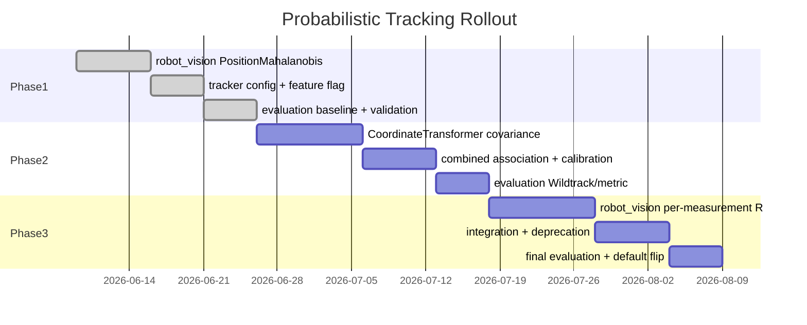

<!--
SPDX-FileCopyrightText: (C) 2026 Intel Corporation
SPDX-License-Identifier: Apache-2.0
-->

# Implementation Plan: Probabilistic Tracking Association

- **Author(s)**: [Sarat Poluri](https://github.com/spoluri)
- **Date**: 2026-06-06
- **Status**: Phase 1 complete; Phases 2–3 open
- **ADR**: [ADR-0017](../../docs/adr/0017-probabilistic-tracking-association.md)
- **Design**: [Probabilistic Tracking Association](../../docs/design/probabilistic-tracking-association.md)
- **Evaluation**: [ADR-0009](../../docs/adr/0009-tracking-evaluation.md), [Tracker Evaluation Pipeline](../../docs/design/tracker-evaluation-pipeline.md)

This plan tracks **tasks, validation, and exit criteria**. Architecture and design detail live in the ADR and design doc above.

---

## Phase 1 — Track-side position Mahalanobis

**Status:** Complete (production default `position_mahalanobis`, `max_radius_m: 10`).

### 1.1 robot_vision

| Task | Location | Notes |
|------|----------|-------|
| Add `DistanceType::PositionMahalanobis` | `ObjectMatching.hpp/.cpp` | 2×2 block on (x,y) |
| Chi-squared gate helper | `ObjectMatching.cpp` / `Utils.hpp` | `df=2` |
| Keep `max_radius_m` as hard ceiling | `ObjectMatching.cpp` | Independent of χ² |
| Velocity-aligned kinematic process noise | `MultiModelKalmanEstimator.cpp` | Along-track ≫ cross-track Q |
| UKF / IMM association covariance fixes | UKF + IMM | Top-model S; Sxy sigma points; yaw-rate init |
| Unit tests | `TrackingTests.cpp`, `tracking_test.py` | Along-track vs lateral preference |
| Python binding | `tracking.cpp` | Expose enum |

### 1.2 Tracker service

| Task | Location |
|------|----------|
| `AssociationConfig` on `TrackingConfig` | `inc/config_loader.hpp` |
| Schema + defaults | `schema/config.schema.json`, `config/tracker.json` |
| Env var overrides | `inc/env_vars.hpp`, `src/config_loader.cpp` |
| Wire method + gate | `src/tracking_worker.cpp` |
| Remove hardcoded 2.0 m association threshold | `src/tracking_worker.cpp` |

Follow [Tracker Agents.md](../../tracker/Agents.md) config checklist.

### 1.3 Controller

| Task | Location |
|------|----------|
| Read association config | `ilabs_tracking.py` |
| Stop averaging `tracking_radius` for association | `ilabs_tracking.py` |
| Feature-flag parity with tracker service | controller tracker config JSON |
| Birth clustering Euclidean ~2 m; equal-weight multi-cam geometry | `MultipleObjectTracker` / fuse path |

### 1.4 Soft deprecation

| Task | Status |
|------|--------|
| Warn when `tracking_radius` differs and method ≠ euclidean | Done / follow-up as needed |
| Document deprecation in object library / user guide | Follow-up PR |
| Do **not** remove `tracking_radius` DB field in Phase 1 | Held |

### Phase 1 exit criteria

- [x] Feature flag ships; `position_mahalanobis` validated vs Euclidean
- [x] Evaluation metrics within thresholds on gated datasets
- [x] CI unit coverage for association wiring
- [x] ADR-0017 → `Accepted` for Phase 1 scope
- [x] Default flip → `position_mahalanobis` after Controller-TC + Wildtrack re-signoff

### Phase 1 validation notes

Artifacts under `/tmp/phase1-signoff/`, `/tmp/phase1-tc-vs-tracker/`, `/tmp/phase1-default-flip/`.

- **Unity Controller-Immediate 10 fps** (2026-08-15): Mahalanobis matched or slightly improved AssA/LocA; lower jitter once config reached category trackers.
- **Covariance shaping** (2026-08-16): fixed isotropic Q / broken Sxy / IMM inflation → velocity-aligned coast ellipses (unit-tested).
- **Unity Immediate 1 fps / Tracker-Service 10 fps** (2026-08-16): essentially tied vs Euclidean.
- **Controller-TC vs Tracker** (2026-08-16): Fix 1 birth Euclidean ~2 m; Fix 2 equal-weight geometry average — CLR HOTA 71→77, IDF1 71→99.
- **Default-flip re-signoff** (2026-08-16):

| Suite | HOTA Δ | AssA Δ | LocA Δ | IDSW Δ | Gate |
|-------|--------|--------|--------|--------|------|
| Unity Controller-TC 10 fps | −0.03 | −0.04 | −0.01 | 0 | **PASS** |
| Wildtrack Tracker-Service 2 fps | **+0.69** | **+0.92** | **+0.51** | +23 | **PASS** primary; IDSW over +5% budget |

Residual: Controller-TC `rms_jerk_ratio` +17% vs +10% budget; Wildtrack IDSW. Accepted for Phase 1; revisit with Phase 2 R.

---

## Phase 2 — Geometry-derived measurement covariance

**Goal:** See [design §5.3](../../docs/design/probabilistic-tracking-association.md#53-phase-2--geometry-derived-measurement-covariance).

### 2.1 Tasks

| Task | Location |
|------|----------|
| Pixel→world Σ_xy in `CoordinateTransformer` | `tracker/src/coordinate_transformer.cpp` |
| `position_covariance_xy` on `Detection` | `tracker/inc/tracking_types.hpp` |
| Optional `measurementCovariance` on `TrackedObject` | `robot_vision` |
| `DistanceType::PositionMahalanobisCombined` | `ObjectMatching.cpp` |
| `measurement_uncertainty.*` config | schema, loader, controller |
| Calibrate α offline; record default | eval harness + design/plan appendix |

### Phase 2 validation

```bash
cd tracker && make test-unit-coverage
```

- Transformer tests: Σ grows with bbox height, range, lower confidence; Jacobian FD vs analytic
- Matching: combined gate wider at long range
- Eval: metric test + Wildtrack; AssA up, ID switches down, LocA hold/improve

### Phase 2 exit criteria

- [ ] α calibrated and documented
- [ ] `position_mahalanobis_combined` passes evaluation thresholds
- [ ] Per-object `tracking_radius` unused in association paths
- [ ] Optional debug emit of Σ_xy for sampled detections

---

## Phase 3 — Per-measurement UKF update

**Goal:** See [design §5.4](../../docs/design/probabilistic-tracking-association.md#54-phase-3--per-measurement-ukf-update).

### 3.1 Tasks

| Task | Location |
|------|----------|
| `correct(measurement, R_optional)` | `MultiModelKalmanEstimator.*` |
| Thread R onto `TrackedObject` before correct | `tracking_worker.cpp`, `ilabs_tracking.py` |
| Global filter noise knobs in config | schema, loader |
| Deprecate `tracking_radius` in manager + user guide | `manager/`, `docs/user-guide/` |
| (Later) multi-cam class/confidence fusion | `fuseMetadata` |

### Phase 3 validation

- Unit: low R pulls strongly; high R weakly; jerk improves vs Phase 2 on noisy detections
- Eval: LocA/jitter gain; AssA holds vs Phase 2
- Load: `cd tracker && make test-load` — transform+track overhead ≤ 10% vs Phase 1

### Phase 3 exit criteria

- [ ] End-to-end: predict → associate(S_pred + R) → correct(R)
- [ ] `tracking_radius` deprecated in object-library docs
- [ ] Default method → `position_mahalanobis_combined`
- [ ] Metrics meet or exceed Phase 2 on gated datasets

---

## Rollout checklist

1. [x] Phase 1 default flip (`position_mahalanobis`); `euclidean` rollback retained
2. [ ] Phase 2 opt-in combined; default stays Phase 1 until sign-off
3. [ ] Phase 3 default flip to combined



---

## File touch list

| Component | Phase 1 | Phase 2 | Phase 3 |
|-----------|---------|---------|---------|
| `robot_vision/ObjectMatching.*` | ✓ | ✓ | |
| `robot_vision/TrackedObject.*` | | ✓ | ✓ |
| `robot_vision/MultiModelKalmanEstimator.*` | | | ✓ |
| `tracker/coordinate_transformer.*` | | ✓ | |
| `tracker/config_loader.*`, schema | ✓ | ✓ | ✓ |
| `tracker/tracking_worker.cpp` | ✓ | ✓ | ✓ |
| `controller/ilabs_tracking.py` | ✓ | ✓ | ✓ |
| `manager/models.py` (deprecation) | | | ✓ |
| `tools/tracker/evaluation/` | ✓ | ✓ | ✓ |
