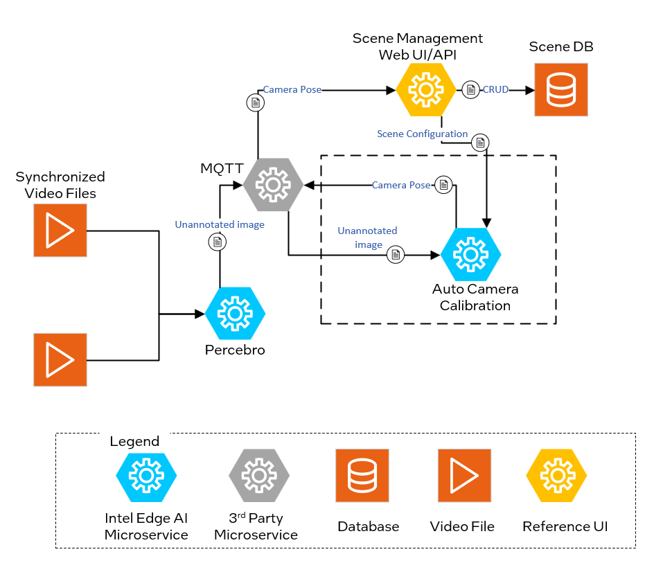
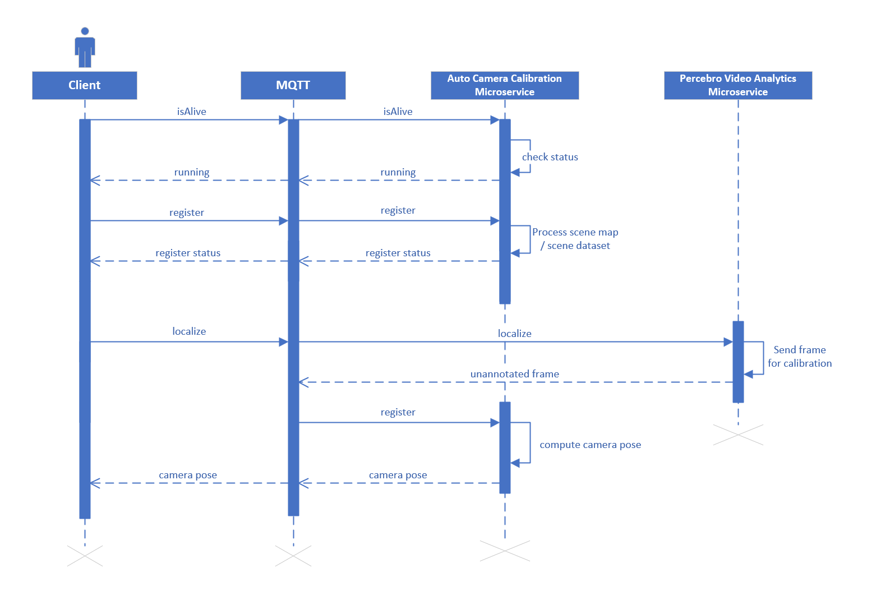

# Auto Camera Calibration Service

Auto camera calibration service computes camera parameters automatically instead of complicated manual calibration methods.

## Overview
The calibration process begins with the client sending a heartbeat command to verify if the calibration service is active. Upon receiving this, the service responds with its current status, such as "running" or "alive." If the status confirms that the service is running, the client issues a command to initiate camera localization. The calibration service then processes this request and returns the resulting camera pose data.

The auto calibration services supports two types of camera calibration methods:

- **AprilTag Calibration**: This method uses fiducial markers called AprilTags placed within the scene. By detecting these markers in the camera's view, the service calculates the camera's position, enhancing calibration accuracy and efficiency.

- **Markerless Calibration**: This approach leverages raw RGBD data from a [Polycam](https://poly.cam/) scan to estimate the camera's pose in the scene, eliminating the need for physical markers.

To deploy the auto calibration service, refer to the [Get started](get-started.md) guide. The service supports configuration through specific arguments and flags, which default to predefined values unless explicitly modified.

### Configurable Arguments and Flags

`--broker`: Hostname or IP of the MQTT broker, optionally with `:port`.

`--brokerauth`: Authentication credentials for the MQTT broker. This can be provided as `user:password` or as a path to a JSON file containing the authentication details.

`--resturl`: Specifies the URL of the REST server used to provide scene configuration details through the REST API.

`--restauth`: Authentication credentials for the REST server. This can be provided as `user:password` or as a path to a JSON file containing the authentication details.

`--rootcert`: Path to the CA (Certificate Authority) certificate used for verifying the authenticity of the server's certificate.

`--cert`: Path to the client certificate file used for secure communication.

## Architecture

*Figure 1: Architecture Diagram*

## Sequence Diagram: Auto Camera Calibration Workflow

The workflow below illustrates the Auto Camera Calibration process. Camera pose is determined through two main steps: **scene registration** and **localization**.

1. **Scene Registration**:
    - The Client sends an "isAlive" message to the MQTT broker to check the status of the Auto Camera Calibration Microservice.
    - Once the service confirms it is operational, the Client sends a "register" request via MQTT.
    - The Microservice processes the scene map for AprilTag-based calibration or the RGBD dataset for markerless calibration.
    - After processing, the service sends the register status back to the Client, confirming successful registration.

2. **Localization**:
    - The Client initiates a "localize" request.
    - The Perebro Video Analytics Microservice responds with an unannotated frame from the camera.
    - The Auto Camera Calibration Microservice processes the frame to detect AprilTags or keypoints, using the registered scene map to compute the camera pose.
    - Finally, the service publishes the calculated camera pose.

*Figure 2: Auto Calibration Sequence diagram*

## Supporting Resources

- [Get Started Guide](get-started.md)
- [API Reference](api-reference.md)
