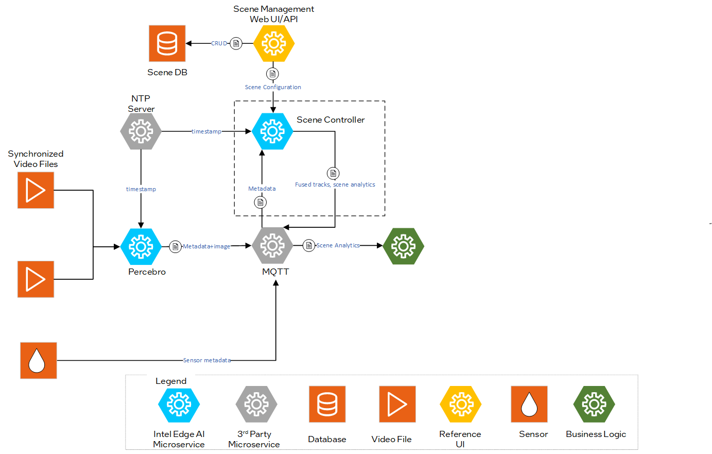

# Scene Controller Microservice
Scene Controller Microservice fuses multimodal sensor data to enable spatial analytics at the edge for multiple use cases.

## Overview

The Scene Controller Microservice answers the fundamental question of `What, When and Where`. It receives object detections from multimodal inputs (primarily multiple cameras), contextualizes them in a common reference frame, fuses them and tracks objects over time.

The Scene Controller's output provides various insights for the tracked objects in a scene, including location, object visibility across cameras, velocity, rotation, center of mass. Additionally, base analytics like regions of interest, tripwires, and sensor regions are supported out of the box to enable developers to build their applications quickly and realize business goals.

To deploy the scene controller service, refer to the [Get started](get-started.md) guide. The service supports configuration through specific arguments and flags, which default to predefined values unless explicitly modified.

### Configurable Arguments and Flags

`--maxlag`: Maximum allowable delay for incoming messages. If a message arrives more than 1 second late, it will be discarded by the Scene Controller. This threshold can be adjusted to accommodate longer inference times, ensuring no messages are discarded. Discarded messages will appear as "FELL BEHINDS" in the service logs.

`--broker`: Hostname or IP of the MQTT broker, optionally with `:port`.

`--brokerauth`: Authentication credentials for the MQTT broker. This can be provided as `user:password` or as a path to a JSON file containing the authentication details.

`--resturl`: Specifies the URL of the REST server used to provide scene configuration details through the REST API.

`--restauth`: Authentication credentials for the REST server. This can be provided as `user:password` or as a path to a JSON file containing the authentication details.

`--rootcert`: Path to the CA (Certificate Authority) certificate used for verifying the authenticity of the server's certificate.

`--cert`: Path to the client certificate file used for secure communication.

`--ntp`: NTP server.

`--tracker_config_file`: Path to the JSON file containing the tracker configuration. This file is used to enable and manage time-based parameters for the tracker.

`--schema_file`: Specifies the path to the JSON file that contains the metadata schema. By default, it uses [metadata.schema.json](../../schema/metadata.schema.json). This schema outlines the structure and format of the messages processed by the service.

`--visibility_topic`: Specifies the topic for publishing visibility information, which includes the visibility of objects in cameras. Options are `unregulated`, `regulated`, or `none`.

### Tracker Configuration

This section is intended to guide users and developers on how to enable the use of time-based parameters during the deployment of Scenescape.

- **How to enable time-based parameters for tracker**:

A `tracker-config.json` file is pre-stored in the `controller` directory. The only change required is to mount this file to the docker container in the `scene` service. The `scene` service in `docker-compose.yml` file should look as follows. Please note the `volumes` section.

```
scene:
    image: scenescape
    init: true
    networks:
      scenescape:
    depends_on:
     - broker
     - web
     - ntpserv
    # - vdms
    command: controller --broker broker.scenescape.intel.com --ntp ntpserv
    volumes:
     - ./media:/home/scenescape/SceneScape/media
     - ./controller/config/tracker-config.json:/home/scenescape/SceneScape/controller/tracker-config.json
    secrets:
     - certs
     - django
     - controller.auth
    restart: always
```

The content of the `tracker-config.json` file is given below. It is recommended to keep the default values of these parameters unchanged.

```
{
  "max_unreliable_frames": 10,
  "non_measurement_frames_dynamic": 8,
  "non_measurement_frames_static": 16,
  "baseline_frame_rate": 30
}
```
Here is a brief description of each of the config parameters.

- `max_unreliable_frames`: This value defines the number of frames the tracker will wait before publishing a tracked object to the web interface GUI. Expects a positive integer.

- `non_measurement_frames_dynamic`: This value defines the number of frames the tracker will wait before deleting a dead tracked object, given the tracked object was dynamic (i.e. non-zero velocity). Expects a positive integer.

- `non_measurement_frames_static`: This value defines the number of frames the tracker will wait before deleting a dead tracked object, given the tracked object was static (i.e. zero velocity). Expects a positive integer.

- `baseline_frame_rate`: The above three parameters are assumed to be optimized for a camera feed with a frame rate = `baseline_frame_rate`. Expects a positive integer.


- **How do the time-based parameters work**:

The time-based tracker parameters enable automatic adjustment of the following three values as a function of the frame rate of the scene camera feeds (instead of using fixed values):

- `max_unreliable_frames`

- `non_measurement_frames_dynamic`

- `non_measurement_frames_static`

For instance, if `max_unreliable_frames` is set to a fixed value, the wait time for publishing reliable tracklets will vary with camera fps. There will be a huge lag between camera feed and the scene update for low fps cameras. When `max_unreliable_frames = 10`, the wait time for 10fps camera = 1 second, compared to the wait time for a 1 fps camera = 10 seconds (too long).

When time-based parameters are enabled, these three parameters will be scaled as a linear function of the camera fps:
```
updated max_unreliable_frames = (default max_unreliable_frames / baseline_frame_rate) × incoming camera frame rate
```

The default values of `max_unreliable_frames` and `baseline_frame_rate` are defined in the `tracker-config.json` file. The same is true for the other two parameters.

Note: If the scene contains multiple cameras publishing at different frame rates, we use the one with the minimum frame rate for the update.

- **Note on changing camera frame rate**:

Re-launching the Scene Controller is necessary if one or multiple camera frame rates are changed adhoc after the initial deployment. In these cases, first use `docker compose down` to terminate the current deployment and re-launch with the command: `docker compose up`, given the necessary modifications to the video sources are done in the `docker-compose.yml` file.


## Architecture


Figure 1: Architecture Diagram

## Sequence Diagram: Scene Controller Workflow

The Client receives regulated scene detections via MQTT, which are the result of processing and filtering raw detections. The pipeline begins when the Scene Controller Microservice receives detections from the camera. It processes these to track moving objects, then publishes scene detections and events through MQTT. These messages may include both regulated (filtered and formatted) and unregulated (raw) scene detections. A Multi Object Tracker Loop is involved in managing detections within MQTT.


*Figure 2: Scene Controller Sequence diagram*

## Supporting Resources

- [Get Started Guide](get-started.md)
- [API Reference](api-reference.md)
