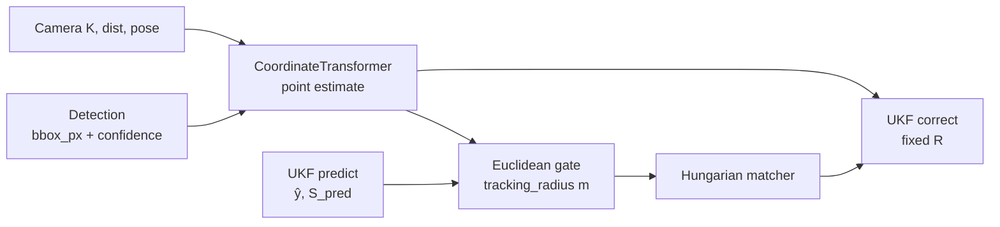
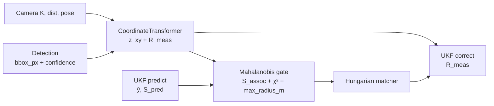

<!--
SPDX-FileCopyrightText: (C) 2026 Intel Corporation
SPDX-License-Identifier: Apache-2.0
-->

# Design Document: Probabilistic Tracking Association

- **Author(s)**: [Sarat Poluri](https://github.com/spoluri)
- **Date**: 2026-06-06
- **Status**: `Accepted` (Phase 1); Phases 2–3 `Proposed`
- **Related ADRs**: [ADR-0017](../adr/0017-probabilistic-tracking-association.md), [ADR-0009](../adr/0009-tracking-evaluation.md)
- **Implementation plan**: [.github/plans/plan-probabilistic-tracking.md](../../.github/plans/plan-probabilistic-tracking.md)
- **Evaluation baseline**: [Tracker Evaluation Pipeline](./tracker-evaluation-pipeline.md)

---

## 1. Overview

This document specifies how [ADR-0017](../adr/0017-probabilistic-tracking-association.md) is realized in `robot_vision`, the tracker service, and the Scene Controller: association distance types, measurement covariance, configuration, stopgaps, and validation expectations. Task checklists and exit criteria live in the [implementation plan](../../.github/plans/plan-probabilistic-tracking.md).

## 2. Goals

- Gate track↔detection association with covariance-aware Mahalanobis distance instead of fixed meter radii.
- Scale gates with object motion / coast (Phase 1) and with viewpoint / range measurement uncertainty (Phase 2).
- Align UKF correct with association noise (Phase 3).
- Keep controller and tracker service behaviorally aligned via shared `robot_vision` and shared association config.
- Ship each phase behind a config flag, validated with the evaluation pipeline before the next phase.

## 3. Non-Goals

- Treating Phase 1 Mahalanobis as a multi-camera localization fix (that is Phase 2 `R_meas`).
- TYPE_2 / ad-hoc multi-cam pose heuristics as the long-term disagreement solution.
- Detector-emitted localization covariance (not available from current pipelines).
- Removing the object-library `tracking_radius` DB field in Phase 1 (soft deprecation only).
- Replacing detection↔detection birth clustering with Mahalanobis while detections lack track `S_pred`.

## 4. Background / Context

`MultipleObjectTracker` runs predict → Hungarian associate → correct. The UKF/IMM stack already produces `predictedMeasurementMean` and `predictedMeasurementCov` (`S_pred`). `CoordinateTransformer` projects bbox foot points to world coordinates using per-camera K, distortion, and pose, but historically emitted point estimates only.

### Problem ownership by phase

| Problem                                                                        | Phase           | Notes                                                                         |
| ------------------------------------------------------------------------------ | --------------- | ----------------------------------------------------------------------------- |
| Association should adapt to **object motion / coast** (not a fixed meter disk) | **1**           | `position_mahalanobis` on `S_pred` + χ²; `max_radius_m` = safety ceiling only |
| **Cameras disagree** on world pose; LocA under multi-view projection bias      | **2**           | Geometry-derived **R_meas**; `S_pred + R`; not Phase 1 gating                 |
| UKF **correct** still uses fixed R while association is probabilistic          | **3**           | Per-measurement R in the filter update                                        |
| Detector confidence / multi-cam class fusion in probabilistic pipeline         | **3–4** (later) | Fold into R / metadata fusion                                                 |

### Legacy association data flow



## 5. Proposed Design

### 5.1 Target association data flow



Phase 1 omits `R_meas` (association uses `S_pred` only; correct still uses fixed R). Phase 2 adds `R_meas` to association. Phase 3 threads `R_meas` into correct.

### 5.2 Phase 1 — Track-side position Mahalanobis

**Association cost** (track↔detection):

```text
d² = (z_xy − ŷ_xy)ᵀ S_pred[0:2,0:2]⁻¹ (z_xy − ŷ_xy)
valid if d² ≤ χ²(p, 2) and ||z_xy − ŷ_xy|| ≤ max_radius_m
```

| Element                | Design choice                                                                                                          |
| ---------------------- | ---------------------------------------------------------------------------------------------------------------------- |
| Distance type          | `DistanceType::PositionMahalanobis` — 2×2 on (x, y); exclude size and yaw                                              |
| Gate                   | `chi2_inv(gate_probability, df=2)`; default `gate_probability=0.99` → χ² ≈ 9.21                                        |
| Safety ceiling         | `max_radius_m` (production default **10**); rejects pairs regardless of Mahalanobis; **not** a multi-cam tolerance     |
| Process noise shaping  | Velocity-aligned kinematic Q (Δt-scaled along-track ≫ cross-track); no direct position Q                               |
| Association covariance | Top IMM model `S_pred`; correct UKF/IMM Sxy handling so coast ellipses elongate along velocity                         |
| Birth clustering       | Detection↔detection remains Euclidean at fixed **`kDefaultBirthClusterRadiusM` ≈ 2 m** (independent of `max_radius_m`) |
| Multi-cam geometry     | Equal-weight average of matched cameras' world geometry (stopgap until Phase 2 R)                                      |
| Config                 | `association.method`, `gate_probability`, `max_radius_m` on tracker + controller                                       |

**Methods:**

| Method                          | Meaning                                            |
| ------------------------------- | -------------------------------------------------- |
| `euclidean`                     | Legacy meter gate (rollback)                       |
| `position_mahalanobis`          | Phase 1 — track-side `S_pred` (production default) |
| `position_mahalanobis_combined` | Phase 2+ — `S_pred + R_meas`                       |

### 5.3 Phase 2 — Geometry-derived measurement covariance

Propagate foot-point pixel uncertainty through the existing undistort → pose → ground-plane pipeline:

```text
σ_px = max(min_pixel_sigma, α · bbox_height_px · f(confidence))
Σ_pixel = diag(σ_px², σ_px²)

J = ∂(x_world, y_world) / ∂(u, v)   # 2×2
Σ_xy = J · Σ_pixel · Jᵀ

Optional: Σ_xy *= (1 / cos(θ))²   # θ = ray vs ground normal
```

Calibrate **α** offline from evaluation datasets (grid search maximizing AssA subject to LocA ≥ baseline).

| Element     | Design choice                                                                                  |
| ----------- | ---------------------------------------------------------------------------------------------- |
| Owner       | `CoordinateTransformer` populates `position_covariance_xy` on `Detection`                      |
| Association | `DistanceType::PositionMahalanobisCombined`; `S_assoc = S_pred[xy] + R_meas[xy]`               |
| Fallback    | Missing `R_meas` → Phase 1 behavior                                                            |
| Config      | `measurement_uncertainty.*` (pixel fraction, confidence scaling, min sigma, incidence scaling) |

### 5.4 Phase 3 — Per-measurement UKF update

| Element      | Design choice                                                                                                   |
| ------------ | --------------------------------------------------------------------------------------------------------------- |
| API          | `MultiModelKalmanEstimator::correct(measurement, R_optional)`; default R from `TrackManagerConfig` when omitted |
| Integration  | Set measurement covariance on `TrackedObject` before `setMeasurement` in tracker worker / controller            |
| Filter knobs | Global `filter.process_noise`, `filter.base_measurement_noise` in tracker config                                |
| Later        | Fuse classification/confidence across multi-cam matches; deprecate `tracking_radius` in manager API/docs        |

### 5.5 Configuration model (target after Phase 3)

```json
{
  "association": {
    "method": "position_mahalanobis_combined",
    "gate_probability": 0.99,
    "max_radius_m": 10.0
  },
  "measurement_uncertainty": {
    "pixel_sigma_fraction_of_bbox_height": 0.03,
    "scale_by_confidence": true,
    "min_pixel_sigma": 2.0,
    "incidence_angle_scaling": true
  },
  "filter": {
    "process_noise": 1e-4,
    "base_measurement_noise": 0.2
  }
}
```

Phase 1 production default: `method: position_mahalanobis`, `max_radius_m: 10.0` (no `measurement_uncertainty` block required). Environment overrides follow tracker service `TRACKER_*` conventions.

### 5.6 Chi-squared gate reference

| gate_probability | χ² threshold (2 DOF) |
| ---------------- | -------------------- |
| 0.90             | 4.605                |
| 0.95             | 5.991                |
| 0.99             | 9.210                |
| 0.999            | 13.816               |

Default recommendation: **0.99**.

## 6. Alternatives Considered

See [ADR-0017 §Alternatives](../adr/0017-probabilistic-tracking-association.md#alternatives-considered). Design-level notes:

- Full 7D Mahalanobis rejected for association because size/yaw innovation is poorly conditioned for SceneScape projections.
- Widening Euclidean radius to “absorb” multi-cam bias rejected; that conflates motion gating with measurement noise and belongs in Phase 2 `R`.

## 7. Risks and Mitigations

| Risk                                  | Mitigation                                                             |
| ------------------------------------- | ---------------------------------------------------------------------- |
| Misspecified Σ_xy causes wrong merges | `max_radius_m` ceiling; offline α calibration; Phase 1 fallback        |
| Chi-squared gate opaque to operators  | Document `gate_probability`; expose AssA/LocA in evaluation dashboards |
| Controller / tracker divergence       | Shared config schema; same `robot_vision`; cross-service evaluation    |
| Jacobian / covariance cost            | Analytic J; foot-point only; load tests (`make test-load`)             |
| Confidence ≠ calibrated uncertainty   | Monotonic scale via α; do not claim Bayesian calibration in user docs  |

## 8. Rollout / Migration Plan

1. **Phase 1** — ship `position_mahalanobis` as production default after gated eval; `euclidean` remains rollback. Equal-weight multi-cam fusion + ~2 m birth clustering as stopgaps.
2. **Phase 2** — opt-in `position_mahalanobis_combined`; default stays Phase 1 until combined sign-off.
3. **Phase 3** — flip default to combined after eval; deprecate `tracking_radius` in object-library docs/API.

Detailed tasks, dates, and exit checkboxes: [implementation plan](../../.github/plans/plan-probabilistic-tracking.md).

## 9. Testing & Monitoring

### Success criteria (all phases)

| Metric               | Tool                                  | Regression threshold (initial) |
| -------------------- | ------------------------------------- | ------------------------------ |
| HOTA                 | TrackEval                             | ≥ baseline − 2%                |
| AssA                 | TrackEval                             | ≥ baseline − 3%                |
| LocA                 | TrackEval                             | ≥ baseline − 2%                |
| ID switches          | TrackEval                             | ≤ baseline + 5%                |
| RMS jerk / jitter    | DiagnosticEvaluator                   | ≤ baseline + 10%               |
| Unit / service tests | `make test-unit`, `make test-service` | All pass                       |

Capture baseline metrics on `main` (Euclidean) before each phase merge. Prefer metric-test + Wildtrack (multi-cam) suites via the [evaluation pipeline](./tracker-evaluation-pipeline.md).

Phase-specific unit tests and sign-off notes are tracked in the [implementation plan](../../.github/plans/plan-probabilistic-tracking.md).

## 10. Open Questions

- Exact α default and confidence mapping after Phase 2 calibration.
- Whether incidence-angle scaling is required on gated datasets or optional.
- Scope of multi-cam class/confidence fusion vs pure R threading in Phase 3.
- Residual Phase 1 acceptances (Controller-TC jerk budget, Wildtrack IDSW) to revisit with Phase 2 R.

## 11. References

- [ADR-0017: Probabilistic Tracking Association](../adr/0017-probabilistic-tracking-association.md)
- [Implementation plan](../../.github/plans/plan-probabilistic-tracking.md)
- [ADR-0009: Tracking Evaluation](../adr/0009-tracking-evaluation.md)
- [Tracker Evaluation Pipeline](./tracker-evaluation-pipeline.md)
- [Tracker Service Design](./tracker-service.md)
- `controller/src/robot_vision` — `ObjectMatching`, `MultiModelKalmanEstimator`, `TrackedObject`
- `tracker/src/coordinate_transformer.cpp` — pixel-to-world projection
