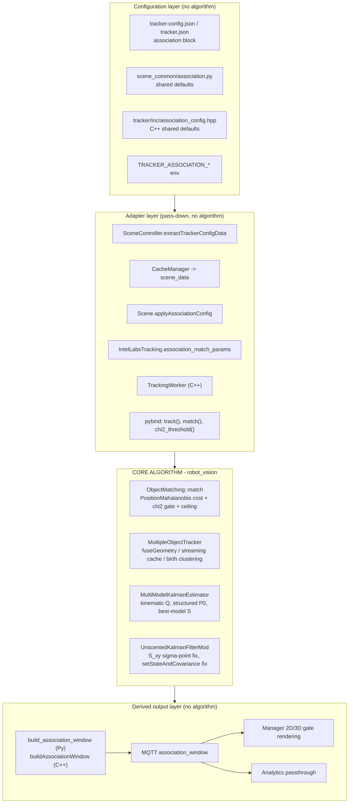

<!--
SPDX-FileCopyrightText: (C) 2026 Intel Corporation
SPDX-License-Identifier: Apache-2.0
-->

# PR Review: `feature/prob-tracking` vs `main`

- **Branch**: `feature/prob-tracking`
- **Merge base**: `d6bccbc0`
- **Commits**: `e02a23f8` (ITEP-96228 Phase 1 Association, #1790), `b3f8fcda` (benchmark fix, #1969), `5b41040e` (merge from main)
- **Size**: 101 files, +4063 / −510
- **Review date**: 2026-09-23
- **Nature**: Report only — no code was changed.

---

## 1. Summary of changes per component

### 1.1 `robot_vision` (shared C++ tracking kernel) — the core algorithm

The only component where tracking behaviour actually changes. Five distinct changes are bundled:

1. **New association metric** `DistanceType::PositionMahalanobis` — a 2×2 Mahalanobis gate on `(x, y)` using the UKF predicted measurement covariance `S_pred`, with a χ² cost threshold and a hard Euclidean `max_radius_m` ceiling.
2. **Process-noise redesign** — the isotropic `Q = I·processNoise` is replaced by a velocity-aligned, Δt-scaled kinematic `Q` with **zero** position/size noise.
3. **Initial covariance redesign** — `P₀` is no longer `I·init_state_covariance`; measured states get `measurement_noise`, latent rates get capped values.
4. **Two UKF/IMM bug fixes** — the cross-covariance `S_xy` now uses the re-drawn predicted-state sigma points, and `setStateAndCovariance()` (previously a silent no-op) now actually writes IMM-mixed state back into the filters.
5. **Multi-camera geometry fusion** — equal-weight averaging of world geometry across cameras, both in the batched path and (new) in the streaming/Immediate path via a 250 ms per-camera measurement cache; cross-camera birth clustering pinned to a fixed 2 m Euclidean radius.

### 1.2 Scene Controller (Python) — configuration pass-down

Pure plumbing plus one new derived output. Reads `association` from `tracker-config.json`, normalises/validates it, maps it to `robot_vision` `match()` parameters, propagates it down `SceneController → CacheManager → Scene → IntelLabsTracking → per-category trackers`, emits a deprecation warning for per-object `tracking_radius`, stamps `camera_id` onto detections (required by the new streaming fusion), and derives an `association_window` gate ellipse for the UI.

### 1.3 Tracker service (C++) — configuration pass-down + an unrelated feature

Two separate things landed together:

- **Association plumbing** (in scope): new `AssociationConfig`, JSON schema block, three `TRACKER_ASSOCIATION_*` env overrides, wiring into `TrackingWorker`, removal of the hard-coded 2.0 m threshold, and `association_window` serialisation onto MQTT.
- **Object-class / `shift_type` projection** (out of scope for ADR-0017): a new Manager `/api/v1/assets` client, `ObjectClassMap` parsing, per-category `shift_type` TYPE_2 foot re-projection and fixed asset footprint offset in `CoordinateTransformer`. This is a *projection-accuracy* feature, not an association feature.

### 1.4 `scene_common` — shared contract

New `association.py` holding the method names and defaults shared by Controller and Tracker; `association_window` threaded through `detections_builder`, `ingestion`, and `cache_manager`.

### 1.5 Manager (web UI)

New "Show Association Windows" toggle in both the 2D SVG scene view and the 3D view. Draws a dashed circle (Euclidean) or ellipse (Mahalanobis) per tracked object. Required a CSS refactor (`.mark circle` → `.mark circle.mark-dot`) so the new gate shapes are not styled as object dots.

### 1.6 Analytics

One-line passthrough of `association_window` into regulated event output.

### 1.7 Benchmarks (`robot_vision/benchmarks`)

Rewritten from a fixed `BM_Tracking50MovingPeople` into a parameterised `BM_Track` harness with a custom `main()`, `--people` / `--cameras` / `--association-config` flags, a `peak_fps` counter, a hand-rolled JSON parser, CMake `FetchContent` fallback for Google Benchmark, and a preprocessor feature-detection hack based on `string(FIND)` over a header file.

### 1.8 Evaluation tooling (`tools/tracker/evaluation`)

Mock Manager now serves `/api/v1/assets` from a new `object_classes` harness config key; Unity black-box configs declare `person` (TYPE_1) and `FW190D` (TYPE_2); all Controller/Tracker eval configs now carry the `association` block.

### 1.9 Documentation

New [ADR-0017](../adr/0017-probabilistic-tracking-association.md), new [design doc](../design/probabilistic-tracking-association.md), new implementation plan, plus `how-to-configure-tracker.md` and `data_formats.md` updates. Unrelated link fixes in `CONTRIBUTING.md` and `mlops-integration-reuse.md`.

---

## 2. Summary of changes per file

### 2.1 Core algorithm (`robot_vision`)

| File | Change |
| --- | --- |
| [../../controller/src/robot_vision/include/rv/Utils.hpp](../../controller/src/robot_vision/include/rv/Utils.hpp#L68-L76) | New `chi2Threshold(p, df)`; closed form `−2·ln(1−p)`, throws for `df != 2` |
| [../../controller/src/robot_vision/include/rv/tracking/ObjectMatching.hpp](../../controller/src/robot_vision/include/rv/tracking/ObjectMatching.hpp#L28) | `DistanceType::PositionMahalanobis`; `match()` gains `max_radius_m` (default ∞) |
| [../../controller/src/robot_vision/src/rv/tracking/ObjectMatching.cpp](../../controller/src/robot_vision/src/rv/tracking/ObjectMatching.cpp#L105-L120) | Per-track 2×2 inverse cache + cost fill; Euclidean branch now also honours `max_radius_m`; cost-function dispatch restructured |
| [../../controller/src/robot_vision/include/rv/tracking/MultipleObjectTracker.hpp](../../controller/src/robot_vision/include/rv/tracking/MultipleObjectTracker.hpp#L68-L72) | `kDefaultBirthClusterRadiusM = 2.0`, `kStreamingMultiCamHold = 250 ms`, `mLastCameraMeasurements` cache, `maxRadiusM` on both `track()` overloads |
| [../../controller/src/robot_vision/src/rv/tracking/MultipleObjectTracker.cpp](../../controller/src/robot_vision/src/rv/tracking/MultipleObjectTracker.cpp#L67-L110) | New `fuseGeometry()` — equal-weight average of x/y/z/l/w/h and circular-mean yaw |
| [../../controller/src/robot_vision/src/rv/tracking/MultipleObjectTracker.cpp](../../controller/src/robot_vision/src/rv/tracking/MultipleObjectTracker.cpp#L253-L340) | New `rememberCameraMeasurement` / `fuseStreamingCameraMeasurements` / `pruneCameraMeasurements` |
| [../../controller/src/robot_vision/src/rv/tracking/MultipleObjectTracker.cpp](../../controller/src/robot_vision/src/rv/tracking/MultipleObjectTracker.cpp#L575-L595) | Birth clustering forced to `DistanceType::Euclidean` @ 2 m; fused seed changed from camera object to accumulated new object |
| [../../controller/src/robot_vision/include/rv/tracking/MultiModelKalmanEstimator.hpp](../../controller/src/robot_vision/include/rv/tracking/MultiModelKalmanEstimator.hpp#L114-L127) | `kinematicProcessNoiseCov()`, `updateProcessNoiseForPredict()`, cached `mProcessNoise` / `mMeasurementNoise` |
| [../../controller/src/robot_vision/src/rv/tracking/MultiModelKalmanEstimator.cpp](../../controller/src/robot_vision/src/rv/tracking/MultiModelKalmanEstimator.cpp#L81-L95) | Structured `P₀`; also clears `mKalmanFilters` / `mSystemModelStates` on re-init (bug fix) |
| [../../controller/src/robot_vision/src/rv/tracking/MultiModelKalmanEstimator.cpp](../../controller/src/robot_vision/src/rv/tracking/MultiModelKalmanEstimator.cpp#L116-L150) | Velocity-aligned `Q(v, Δt)` with 1000× scaling constant |
| [../../controller/src/robot_vision/src/rv/tracking/MultiModelKalmanEstimator.cpp](../../controller/src/robot_vision/src/rv/tracking/MultiModelKalmanEstimator.cpp#L292-L305) | Association `S` switched from IMM mixture to highest-probability model |
| [../../controller/src/robot_vision/include/rv/tracking/UnscentedKalmanFilter.hpp](../../controller/src/robot_vision/include/rv/tracking/UnscentedKalmanFilter.hpp#L120-L129) | `setStateAndCovariance` no-op fixed; new `setProcessNoiseCov` |
| [../../controller/src/robot_vision/src/rv/tracking/UnscentedKalmanFilter.cpp](../../controller/src/robot_vision/src/rv/tracking/UnscentedKalmanFilter.cpp#L192-L197) | `S_xy` now computed from re-drawn predicted-state sigma points |
| [../../controller/src/robot_vision/src/rv/tracking/CameraUtils.cpp](../../controller/src/robot_vision/src/rv/tracking/CameraUtils.cpp#L35) | Whitespace only |
| [../../controller/src/robot_vision/include/rv/tracking/TrackManager.hpp](../../controller/src/robot_vision/include/rv/tracking/TrackManager.hpp#L40) | Whitespace only |

### 2.2 Binding layer

| File | Change |
| --- | --- |
| [../../controller/src/robot_vision/python/src/robot_vision/extensions/tracking.cpp](../../controller/src/robot_vision/python/src/robot_vision/extensions/tracking.cpp#L175) | Exposes `PositionMahalanobis`, `chi2_threshold()`, and `max_radius_m` on both `track()` overloads and on `match()`; `match()` lambda parameters renamed to match their `py::arg` names (no behaviour change) |

### 2.3 Scene Controller (Python)

| File | Change |
| --- | --- |
| [../../controller/src/controller/ilabs_tracking.py](../../controller/src/controller/ilabs_tracking.py#L44-L101) | `normalize_association_config()` — validation, defaults, range clamping, deprecation warning |
| [../../controller/src/controller/ilabs_tracking.py](../../controller/src/controller/ilabs_tracking.py#L103-L122) | `association_match_params()` — maps config to `(DistanceType, threshold, max_radius_m)` |
| [../../controller/src/controller/ilabs_tracking.py](../../controller/src/controller/ilabs_tracking.py#L124-L180) | `build_association_window()` — eigendecomposition of `S_pred[0:2,0:2]` into a χ² ellipse |
| [../../controller/src/controller/ilabs_tracking.py](../../controller/src/controller/ilabs_tracking.py#L324-L328) | Stamps `attributes['camera_id']` — prerequisite for streaming multi-cam fusion |
| [../../controller/src/controller/ilabs_tracking.py](../../controller/src/controller/ilabs_tracking.py#L331-L343) | `_warn_deprecated_tracking_radius()` |
| [../../controller/src/controller/ilabs_tracking.py](../../controller/src/controller/ilabs_tracking.py#L344-L356) | `update_tracks()` — drops `tracking_radius` averaging, uses association config |
| [../../controller/src/controller/ilabs_tracking.py](../../controller/src/controller/ilabs_tracking.py#L478-L498) | `update_tracks_batched()` — same |
| [../../controller/src/controller/scene.py](../../controller/src/controller/scene.py#L92) | `Scene.association_config`, `applyAssociationConfig()`, hydration hook |
| [../../controller/src/controller/scene_controller.py](../../controller/src/controller/scene_controller.py#L168-L182) | Parses the `association` block from tracker config |
| [../../controller/src/controller/time_chunking.py](../../controller/src/controller/time_chunking.py#L142-L155) | Threads `association_config` into per-category trackers |
| [../../controller/src/controller/tracking.py](../../controller/src/controller/tracking.py#L98-L110) | `_createTrackers()` forwards `association_config` when present |
| [../../controller/config/tracker-config.json](../../controller/config/tracker-config.json), [../../controller/config/tracker-config-immediate.json](../../controller/config/tracker-config-immediate.json) | Default `association` block |

### 2.4 `scene_common`

| File | Change |
| --- | --- |
| [../../scene_common/src/scene_common/association.py](../../scene_common/src/scene_common/association.py) | **New.** Method names, defaults, `DEFAULT_ASSOCIATION_CONFIG` |
| [../../scene_common/src/scene_common/cache_manager.py](../../scene_common/src/scene_common/cache_manager.py#L145) | Injects `association_config` into scene data |
| [../../scene_common/src/scene_common/detections_builder.py](../../scene_common/src/scene_common/detections_builder.py#L281) | Publishes `association_window` |
| [../../scene_common/src/scene_common/ingestion.py](../../scene_common/src/scene_common/ingestion.py#L169) | Ingests `association_window` |

### 2.5 Tracker service (C++)

| File | Change |
| --- | --- |
| [../../tracker/inc/association_config.hpp](../../tracker/inc/association_config.hpp) | **New.** `AssociationConfig`, `distanceType()`, `costThreshold()`, parse/serialise helpers |
| [../../tracker/inc/association_window.hpp](../../tracker/inc/association_window.hpp) | **New.** `buildAssociationWindow()` via `cv::eigen` on `S_pred[0:2,0:2]` |
| [../../tracker/inc/object_class.hpp](../../tracker/inc/object_class.hpp), [../../tracker/src/object_class.cpp](../../tracker/src/object_class.cpp) | **New.** Manager assets → `shift_type` + footprint map (out of ADR scope) |
| [../../tracker/inc/config_loader.hpp](../../tracker/inc/config_loader.hpp#L145), [../../tracker/src/config_loader.cpp](../../tracker/src/config_loader.cpp#L315-L440) | JSON pointers + env overrides |
| [../../tracker/inc/env_vars.hpp](../../tracker/inc/env_vars.hpp#L61-L68) | `TRACKER_ASSOCIATION_*` |
| [../../tracker/inc/manager_rest_client.hpp](../../tracker/inc/manager_rest_client.hpp#L39), [../../tracker/src/manager_rest_client.cpp](../../tracker/src/manager_rest_client.cpp#L166) | `fetchAssets()` |
| [../../tracker/src/api_scene_loader.cpp](../../tracker/src/api_scene_loader.cpp#L199-L208) | Soft-fail asset load |
| [../../tracker/inc/coordinate_transformer.hpp](../../tracker/inc/coordinate_transformer.hpp#L59), [../../tracker/src/coordinate_transformer.cpp](../../tracker/src/coordinate_transformer.cpp#L195-L235) | TYPE_2 foot re-projection + fixed footprint offset |
| [../../tracker/src/tracking_worker.cpp](../../tracker/src/tracking_worker.cpp#L297-L315) | Uses `association_config_`; removed hard-coded 2.0 m |
| [../../tracker/src/track_publisher.cpp](../../tracker/src/track_publisher.cpp#L109-L128) | Serialises `association_window` |
| [../../tracker/inc/time_chunk_scheduler.hpp](../../tracker/inc/time_chunk_scheduler.hpp#L49), [../../tracker/src/time_chunk_scheduler.cpp](../../tracker/src/time_chunk_scheduler.cpp#L175-L180) | Per-category `ObjectClassConfig` lookup |
| [../../tracker/schema/config.schema.json](../../tracker/schema/config.schema.json#L258), [../../tracker/schema/scene-data.schema.json](../../tracker/schema/scene-data.schema.json#L147) | Schema for `association` and `association_window` |
| [../../tracker/config/tracker.json](../../tracker/config/tracker.json#L49) | Default `association` block |

### 2.6 Manager UI

| File | Change |
| --- | --- |
| [../../manager/src/manager/static/js/assetmanager.js](../../manager/src/manager/static/js/assetmanager.js#L91-L165) | 3D `THREE.LineLoop` gate geometry, lifecycle, visibility toggle |
| [../../manager/src/manager/static/js/marks.js](../../manager/src/manager/static/js/marks.js#L53-L80) | 2D SVG circle/ellipse gate; `.mark-dot` selector fix for trail stroke colour |
| [../../manager/src/manager/static/js/scenescape3d.js](../../manager/src/manager/static/js/scenescape3d.js#L106-L122) | GUI toggle |
| [../../manager/src/manager/static/js/sscape.js](../../manager/src/manager/static/js/sscape.js#L43) | `show_association_windows` state + checkbox binding |
| [../../manager/src/manager/templates/sscape/sceneDetail.html](../../manager/src/manager/templates/sscape/sceneDetail.html#L184-L198) | Toggle markup |
| [../../manager/src/manager/static/css/style.css](../../manager/src/manager/static/css/style.css#L241-L270) | `.association-window` styles; `.mark circle` → `.mark circle.mark-dot` |

### 2.7 Tests

| File | Change |
| --- | --- |
| [../../controller/src/robot_vision/test/TrackingTests.cpp](../../controller/src/robot_vision/test/TrackingTests.cpp#L707-L930) | 5 new gtests: χ² value, along-track preference, multi-cam birth fusion, batched averaging, streaming averaging |
| [../../tests/sscape_tests/robot_vision/tracking_test.py](../../tests/sscape_tests/robot_vision/tracking_test.py#L321-L470) | Python mirrors of the above; **velocity tolerances loosened 0.01 → 0.05** |
| [../../tests/sscape_tests/scenescape/test_ilabs_tracking.py](../../tests/sscape_tests/scenescape/test_ilabs_tracking.py#L16-L300) | Config normalisation, match-param mapping, window building, propagation |
| [../../tests/sscape_tests/scenescape/test_scene_controller.py](../../tests/sscape_tests/scenescape/test_scene_controller.py#L22-L410) | Tracker-config parsing, scene hydration propagation |
| [../../tests/sscape_tests/scenescape/test_detections_builder.py](../../tests/sscape_tests/scenescape/test_detections_builder.py#L201) | `association_window` passthrough |
| [../../tracker/test/unit/config_loader_test.cpp](../../tracker/test/unit/config_loader_test.cpp#L727-L840) | 6 new association config tests |
| [../../tracker/test/unit/object_class_test.cpp](../../tracker/test/unit/object_class_test.cpp) | **New.** 4 asset-parsing tests |
| [../../tracker/test/unit/manager_rest_client_test.cpp](../../tracker/test/unit/manager_rest_client_test.cpp#L268-L297) | `fetchAssets` tests |
| [../../tracker/test/unit/tracking_worker_test.cpp](../../tracker/test/unit/tracking_worker_test.cpp#L1000-L1030) | Association config selection |
| [../../tracker/test/unit/track_publisher_test.cpp](../../tracker/test/unit/track_publisher_test.cpp#L360-L392) | `association_window` serialisation |
| [../../tracker/test/unit/coordinate_transformer_test.cpp](../../tracker/test/unit/coordinate_transformer_test.cpp#L512-L552) | `shift_type` storage; footprint override |
| [../../tracker/test/unit/api_scene_loader_test.cpp](../../tracker/test/unit/api_scene_loader_test.cpp#L46-L60) | Assets in mock factory |

### 2.8 Benchmarks, tooling, docs

| File | Change |
| --- | --- |
| [../../controller/src/robot_vision/benchmarks/MultipleObjectTrackerBenchmark.cpp](../../controller/src/robot_vision/benchmarks/MultipleObjectTrackerBenchmark.cpp) | Full rewrite: parameterised sweep, custom `main()`, hand-rolled JSON parser |
| [../../controller/src/robot_vision/benchmarks/CMakeLists.txt](../../controller/src/robot_vision/benchmarks/CMakeLists.txt#L8-L60) | `FetchContent` fallback; header-grep feature detection |
| [../../controller/src/robot_vision/benchmarks/run_benchmark.sh](../../controller/src/robot_vision/benchmarks/run_benchmark.sh), [../../controller/src/robot_vision/benchmarks/compare_benchmarks.sh](../../controller/src/robot_vision/benchmarks/compare_benchmarks.sh) | Arg parsing, venv bootstrap, `rm -rf` of tools dir |
| `controller/src/robot_vision/benchmarks/configs/association_{euclidean,production}.json` | **New.** Benchmark association presets |
| [../../tools/tracker/evaluation/harnesses/black_box_harness/mock_manager.py](../../tools/tracker/evaluation/harnesses/black_box_harness/mock_manager.py#L123-L152) | `_assets_from_object_classes()` |
| [../../tools/tracker/evaluation/harnesses/black_box_harness/black_box_harness.py](../../tools/tracker/evaluation/harnesses/black_box_harness/black_box_harness.py#L436-L440) | `object_classes` config key |
| `tools/tracker/evaluation/pipeline_configs/**` | `association` blocks + `object_classes` |
| [../adr/0017-probabilistic-tracking-association.md](../adr/0017-probabilistic-tracking-association.md), [../design/probabilistic-tracking-association.md](../design/probabilistic-tracking-association.md), [../../.github/plans/plan-probabilistic-tracking.md](../../.github/plans/plan-probabilistic-tracking.md) | **New** |
| [../user-guide/microservices/controller/how-to-configure-tracker.md](../user-guide/microservices/controller/how-to-configure-tracker.md#L250-L280), [../user-guide/microservices/controller/data_formats.md](../user-guide/microservices/controller/data_formats.md#L445) | User-facing docs |
| [../../CONTRIBUTING.md](../../CONTRIBUTING.md#L72), [../design/mlops-integration-reuse.md](../design/mlops-integration-reuse.md#L59) | Unrelated link fixes |

---

## 3. Layering: core algorithm vs. wrappers



**Division line.** Everything above `CORE` only decides *which* `DistanceType`, *which* cost threshold, and *which* `max_radius_m` to hand to `rv::tracking::match()`. Everything below `CORE` only reads `predictedMeasurementCov` and turns it into a drawable shape. Behavioural risk is concentrated almost entirely in the four `CORE` files — and notably, **three of the four core changes (Q, P₀, UKF fixes) are not association changes at all**; they alter filter output for every scene regardless of `association.method`.

---

## 4. Core algorithm — detailed walkthrough

### Group A — Mahalanobis association gate

**In simple terms.** Previously a detection could update a track only if it was within a fixed number of metres (2 m by default). That radius was the same for a stationary forklift and a sprinting person, and the same on the frame after a detection as after a 2-second dropout. Now the tracker asks a statistical question instead: *given how uncertain I am about where this track should be right now, how surprising is this detection?* A confident track accepts only nearby detections; a track that has been coasting blind accepts detections further away — and further away **along its direction of travel**, not sideways.

**Implementation.** The UKF already produces the predicted measurement mean `ŷ` and covariance `S_pred = H P Hᵀ + R` during `predict()`. The new cost is the squared Mahalanobis distance restricted to the position block:

$$d^2 = (z_{xy} - \hat{y}_{xy})^\top\,S_{\text{pred}}[0{:}2,0{:}2]^{-1}\,(z_{xy} - \hat{y}_{xy})$$

Acceptance requires `d² ≤ χ²(p, 2)` **and** `‖z − ŷ‖ ≤ max_radius_m`.

- [Utils.hpp](../../controller/src/robot_vision/include/rv/Utils.hpp#L68-L76) implements the χ² inverse CDF in closed form for 2 DOF: `−2·ln(1−p)` (0.99 → 9.2103). No table, no Boost dependency. `df != 2` throws.
- [ObjectMatching.cpp](../../controller/src/robot_vision/src/rv/tracking/ObjectMatching.cpp#L84-L120) inverts the 2×2 block analytically **once per track** into a `PositionMahalanobisTrackCache`, then fills the `T×D` cost matrix under `#pragma omp parallel for collapse(2)`. Degenerate covariance (`|det| < 1e-12`) and beyond-ceiling pairs both return the sentinel `kDefaultClassBoundValue` (1000.0), which exceeds the χ² threshold and so is never assigned by the Hungarian matcher.
- The ceiling is checked **before** the cache-validity check, so an out-of-range detection short-circuits even for a degenerate track.
- The Euclidean branch was also changed: it is now wrapped in a lambda that applies the same `max_radius_m` ceiling on top of the existing `cost_thresh`. In production this is redundant (Controller passes `distance_threshold == max_radius_m`), but it makes `match()` uniform.
- Size, height and yaw are deliberately excluded from the gate — the design doc argues those innovations are poorly conditioned for SceneScape's monocular ground-plane projections.

### Group B — Making `S_pred` mean something (process noise + initial covariance)

**In simple terms.** A Mahalanobis gate is only as good as the covariance it divides by. Before this PR the covariance was essentially a round blob whose size barely changed with motion — so a Mahalanobis gate would have behaved almost exactly like the old circle. Three changes make the blob become a *cigar* pointing along the direction of travel, and make it grow the longer the track coasts without detections.

**B1 — Velocity-aligned kinematic Q** ([MultiModelKalmanEstimator.cpp](../../controller/src/robot_vision/src/rv/tracking/MultiModelKalmanEstimator.cpp#L116-L150)).

Old: `Q = I₁₂ · process_noise` — a constant, isotropic, Δt-independent injection into *every* state including position and size.

New: `Q` is rebuilt before each `predict()` from the current velocity and Δt:

- unit vector `(cₐ, sₐ) = v/‖v‖` (falls back to `(1,0)` below 1e-3 m/s);
- `q_along = q_vel·(1 + speed)`, `q_cross = q_vel·0.01` — a 100:1 anisotropy;
- rotate into world frame: `Q_xx = (cₐ²·q_along + sₐ²·q_cross)·Δt`, etc., with the off-diagonal `Q_xy` term;
- the same 2×2 block is written into **both** the velocity `(2,3)` and acceleration `(4,5)` slots;
- yaw gets `process_noise·0.01·Δt`, yaw-rate `process_noise·Δt`;
- **position `(0,1)` and size `(6,7,8,9)` get exactly zero.**

Position uncertainty is therefore no longer injected directly — it *emerges* through the state-transition function propagating velocity uncertainty, which is what makes the ellipse elongate along the track.

`q_vel = max(process_noise · 1000.0, 1e-3)`. The 1000× factor is a re-scaling constant chosen so the legacy `process_noise = 1e-4` produces metre-scale along-track growth over a ~1 s coast.

**B2 — Structured `P₀`** ([MultiModelKalmanEstimator.cpp](../../controller/src/robot_vision/src/rv/tracking/MultiModelKalmanEstimator.cpp#L81-L95)).

Old: `P₀ = I₁₂ · init_state_covariance`. New: directly measured states (`x, y, z, length, width, height`) are seeded at `measurement_noise`; velocity at `min(init, 0.05)`; acceleration at `min(init, 0.1)`; yaw at `min(init, 0.05)`; yaw-rate at `min(init, 0.01)`. Rationale: a large isotropic `P_v` made a freshly born track's first coast produce a huge round gate, defeating the point of the anisotropic design.

**B3 — Re-init hygiene.** `initialize()` now also clears `mKalmanFilters` and `mSystemModelStates`. Previously only `mSystemModels` was cleared, so re-initialising an estimator appended duplicate filters. Genuine latent bug fix.

### Group C — UKF correctness fixes

**C1 — Cross-covariance sigma-point mismatch** ([UnscentedKalmanFilter.cpp](../../controller/src/robot_vision/src/rv/tracking/UnscentedKalmanFilter.cpp#L192-L197)).

*In simple terms:* the Kalman gain is computed from the correlation between "where the state could be" and "what I'd measure". The two halves of that correlation were being computed from two different sets of sample points, so the correlation was wrong — and specifically, the velocity part came out too small, which meant measurements barely taught the filter anything about speed.

*Implementation:* this UKF variant re-draws sigma points from the **predicted** `(state, errorCov)` at the end of `predict()` before evaluating `h(·)`, so `measurementSPFuncValsCenter` is centred on that second sigma set ([predict()](../../controller/src/robot_vision/src/rv/tracking/UnscentedKalmanFilter.cpp#L158-L182)). `correct()` however still paired it with `transitionSPFuncValsCenter`, which is `f(prior sigma points) − state` — the *first* set. The fix computes `sigmaPoints − state` and uses that. Since `errorCov = errorCov − gain·S_xyᵀ` also depends on `S_xy`, this corrects both the gain and the posterior covariance. This is the change that makes velocity observable, which in turn is what makes the anisotropic `Q` in Group B actually shape the gate.

**C2 — `setStateAndCovariance()` was a no-op** ([UnscentedKalmanFilter.hpp](../../controller/src/robot_vision/include/rv/tracking/UnscentedKalmanFilter.hpp#L120-L124)).

The old body was `state = state.clone(); errorCov = errorCov.clone();` — the parameters shadowed the members, so the function assigned the parameters to themselves and discarded the caller's values. Its only caller is the IMM mixing step at [MultiModelKalmanEstimator.cpp#L245](../../controller/src/robot_vision/src/rv/tracking/MultiModelKalmanEstimator.cpp#L245). **The IMM interaction/mixing step therefore never had any effect before this PR.** Fixing it turns a degenerate bank of independent filters into a real IMM — a large, silent behavioural change for every multi-model configuration.

**C3 — Association covariance = best model, not mixture** ([MultiModelKalmanEstimator.cpp](../../controller/src/robot_vision/src/rv/tracking/MultiModelKalmanEstimator.cpp#L292-L305)).

The IMM mixture covariance includes a spread term `Σᵢ μᵢ (yᵢ − ȳ)(yᵢ − ȳ)ᵀ` that inflates roughly isotropically whenever models disagree. A low-probability CTRV hypothesis could therefore blow the gate open. The code now picks `argmaxᵢ μᵢ` and uses that model's `S` for `predictedMeasurementCov` / `...CovInv`. The mixture mean is still used for `predictedMeasurementMean`, so mean and covariance now come from different distributions.

### Group D — Multi-camera geometry fusion

**In simple terms.** When two cameras see the same person, their ground-plane projections disagree by roughly a metre. Previously the tracker just took whichever camera was processed last, so a stationary object would visibly hop between two positions. Now it averages.

**D1 — Batched path** ([MultipleObjectTracker.cpp#L472](../../controller/src/robot_vision/src/rv/tracking/MultipleObjectTracker.cpp#L472)). `fuseGeometry()` ([L67](../../controller/src/robot_vision/src/rv/tracking/MultipleObjectTracker.cpp#L67-L110)) equal-weight-averages `x, y, z, length, width, height` and takes the circular mean of yaw via `atan2(Σsin/n, Σcos/n)`. Metadata fusion policy (confidence / camera order) is unchanged and still runs afterwards.

**D2 — Streaming (Immediate) path** ([L253–L340](../../controller/src/robot_vision/src/rv/tracking/MultipleObjectTracker.cpp#L253-L340)). The Immediate mode never sees all cameras in one call, so a per-track, per-camera cache (`mLastCameraMeasurements`, keyed on `attributes["camera_id"]`) retains each camera's last measurement for `kStreamingMultiCamHold = 250 ms`. On each matched assignment the incoming measurement is remembered, then geometry is averaged across all cached cameras still inside the hold window. `pruneCameraMeasurements()` drops entries for dead tracks and expired samples on every `track()` call, including the empty-input early return.

**D3 — Birth clustering pinned to Euclidean 2 m** ([L575–L595](../../controller/src/robot_vision/src/rv/tracking/MultipleObjectTracker.cpp#L575-L595)). Cross-camera clustering of *unmatched detections* cannot use Mahalanobis: raw detections carry no `predictedMeasurementCov`, so the 2×2 block is empty/degenerate and every pair is rejected — producing duplicate frozen tracks for the same person. The call is therefore hard-coded to `DistanceType::Euclidean` at `kDefaultBirthClusterRadiusM = 2.0`, explicitly *not* `max_radius_m`, so a 10 m association ceiling does not over-merge nearby people at birth. The fused seed also changed from the camera object to the accumulated new object.

### Group E — API surface

`match()` and both `track()` overloads gained a trailing `max_radius_m` defaulting to `std::numeric_limits<double>::infinity()`, so existing callers are source-compatible. The pybind layer mirrors this and adds `chi2_threshold()`.

---

## 5. Test coverage of the core algorithm

### 5.0 What exists, and whether it runs

| Suite | New tests | Runs in CI? |
| --- | --- | --- |
| [../../controller/src/robot_vision/test/TrackingTests.cpp](../../controller/src/robot_vision/test/TrackingTests.cpp#L707-L930) (gtest) | 5 | **No** — the `RobotVisionTests` binary is built only by `make cpp-tests` in [../../controller/src/robot_vision/Makefile](../../controller/src/robot_vision/Makefile#L27-L30); that target is referenced by no root `Makefile` target and no workflow under `.github/workflows/` |
| [../../tests/sscape_tests/robot_vision/tracking_test.py](../../tests/sscape_tests/robot_vision/tracking_test.py#L321-L470) (pytest) | 4 | Yes |
| [../../tests/sscape_tests/scenescape/test_ilabs_tracking.py](../../tests/sscape_tests/scenescape/test_ilabs_tracking.py#L20-L142) | 8 | Yes — but all are config/pure-function tests, none touch `robot_vision` behaviour |
| [../../tracker/test/unit/config_loader_test.cpp](../../tracker/test/unit/config_loader_test.cpp#L727-L840), [tracking_worker_test.cpp](../../tracker/test/unit/tracking_worker_test.cpp#L1000-L1030) | 8 | Yes — config wiring assertions only |

Two structural facts dominate everything below:

- **The gtest suite is not executed.** Of the five new C++ tests, three are mirrored in pytest. The two that are not — `MultiCameraTrackUpdateAveragesWorldPosition` (partially mirrored) and `StreamingMultiCameraUpdatesAverageWorldPosition` (**not mirrored at all**) — therefore have zero executed coverage.
- **Every new core test forces a single motion model.** All five gtests and all three behavioural pytest tests set `motion_models = [CV]`, while the production default in [TrackManager.hpp](../../controller/src/robot_vision/include/rv/tracking/TrackManager.hpp#L35) is `{CV, CA, CTRV}`. The new tests therefore exercise `singleModelPredict()` exclusively and never enter `predictState()` — where both the IMM mixing fix (C2) and the best-model covariance selection (C3) live.

### 5.1 Group A — Mahalanobis association gate

| Behaviour | Covered by | Verdict |
| --- | --- | --- |
| χ²(0.99, 2) ≈ 9.2103 | `Chi2ThresholdMatchesExpectedQuantile`, `test_chi2_threshold` | ✅ basic |
| Anisotropic gate prefers along-track detection | `PositionMahalanobisPrefersAlongTrackAxis`, `test_position_mahalanobis_prefers_motion_axis` | ⚠️ partial (see below) |
| `PositionMahalanobis` selectable end-to-end from config | `AssociationConfigSelectsDistanceType`, `test_association_match_params_mahalanobis_uses_chi2_gate` | ✅ wiring only |

**Basic scenario — one real assertion.** Only the Hungarian outcome (`assignments[0] == (0, 0)` for two detections at equal Euclidean distance) genuinely tests the new cost function. That is the right test to have, and it passes for the right reason.

**The second half of both tests is a tautology.** After the real assertion, both tests compute

```text
d2_ahead   = dx² · s11 / (s00·s11)
d2_lateral = dy² · s00 / (s00·s11)
```

from `s00`/`s11` values the test read out of the track, then assert `d2_ahead < d2_lateral`. With `dx == dy == 2` this reduces to `4/s00 < 4/s11`, which follows trivially from the earlier `EXPECT_GT(s00, 1.5 * s11)`. No value produced by `positionMahalanobisCostFromCache` is ever compared against anything. The formula also silently assumes `s01 == 0`; the implementation makes no such guarantee (the kinematic `Q` has off-diagonal terms — they merely vanish for the pure +x motion used here).

**Dead test code.** In the gtest, the second `rv::tracking::match(...)` call with `{lateral}` alone populates `assignments` / `unassignedTracks` / `unassignedMeasurements` and then asserts nothing on them. The comment ("Lateral-only may still pass the chi2 gate") acknowledges the outcome is indeterminate, which is exactly why it should be pinned rather than left dangling.

**Edge cases — none covered:**

- Other gate probabilities (0.90 / 0.95 / 0.999) against the table in [design §5.6](../design/probabilistic-tracking-association.md).
- `gate_probability = 1.0` hitting the `clamp(p, 1e-9, 1 - 1e-9)` guard in [Utils.hpp](../../controller/src/robot_vision/include/rv/Utils.hpp#L68-L76).
- `chi2Threshold(p, df != 2)` throwing `std::invalid_argument` (and its pybind translation to `ValueError`).
- **The `max_radius_m` ceiling rejecting a track↔detection pair.** The only ceiling-vs-radius test in the suite (`test_position_mahalanobis_fuses_multi_camera_detections`, second half) exercises *birth clustering*, not association. Nothing asserts that a detection which passes χ² but exceeds `max_radius_m` is rejected — the headline safety property of the design.
- **Degenerate covariance** (`|det| < 1e-12`) falling back to `kDefaultClassBoundValue`.
- **Empty `predictedMeasurementCov`** — the unguarded-`at<>()` hazard in finding #3 is directly attributable to this gap.
- The new `max_radius_m` wrapper on the **Euclidean** branch of `match()`.
- `max_radius_m = 0`, negative, or `infinity`.
- Costs exceeding `kDefaultClassBoundValue = 1000.0` (finding #12).
- **Competing tracks.** Every new test has exactly one track. The Hungarian matcher's global optimum under a Mahalanobis cost — where a detection near two tracks with very different covariances must go to the statistically closer one, not the metrically closer one — is the whole point of the change and is untested.
- Empty `tracks` / empty `measurements` with `PositionMahalanobis`.

### 5.2 Group B — process noise and initial covariance

| Behaviour | Covered by | Verdict |
| --- | --- | --- |
| Coast ellipse elongates along velocity | `EXPECT_GT(s00, 1.5 * s11)` after a 1 s coast, in both the gtest and pytest variant | ⚠️ single data point |
| `kinematicProcessNoiseCov()` itself | — | ❌ none |
| `errorCovInit` structure | — | ❌ none |
| Re-init hygiene (B3) | — | ❌ none |

The one assertion is a coarse integration check: seed a CV track at `vx = 5`, feed 10 measurements, coast 1 s, assert `s00 > 1.5·s11`. It is the only thing standing between the 1000× `kVelocityNoiseScale`, the 100:1 `kCrossTrackRatio`, the `qVel` floor, the `(1 + speed)` term, the Δt scaling and a silent regression. Any of those constants could be changed by an order of magnitude and this test would still pass.

**Edge cases — none covered:**

- **Zero / near-zero velocity**, where `speed > 1e-3` fails and the direction falls back to `(cₐ, sₐ) = (1, 0)` — i.e. a stationary track gets an ellipse pinned to the world +X axis regardless of its history. This is a plausible source of wrong gating for static objects and nothing tests it.
- **Diagonal motion** (e.g. `vx == vy`), the only case where the off-diagonal `Q_xy` term is non-zero and the rotation into world frame is actually exercised. All tests use pure +X motion, where `sₐ = 0` and the rotation collapses to identity.
- **Δt scaling** — no test coasts for two different durations and compares growth.
- **The `q_vel` floor** `max(process_noise · 1000, 1e-3)` — no test shows `process_noise` below ~1e-6 is inert.
- **Zero `Q` on position and size** (finding #2). No test asserts `Q(0,0) == 0`, and no soak/long-duration test detects the monotonic collapse of `P_size`. A characterisation test over a few thousand frames would be cheap and would catch both the gain collapse and any Cholesky failure.
- `errorCovInit` caps — no test that `init_state_covariance = 100` is clamped to 0.05 for velocity, nor that the six measured states are seeded from `measurement_noise` rather than `init_state_covariance`. Both parameters silently changed meaning (finding #4) with no test pinning either semantics.
- Re-initialising an estimator twice and asserting `mKalmanFilters.size()` does not double — the exact bug B3 fixes.

### 5.3 Group C — UKF correctness fixes

| Behaviour | Covered by | Verdict |
| --- | --- | --- |
| C1 — `S_xy` from re-drawn sigma points | Only indirectly, via constant-velocity convergence tests whose tolerances were **loosened 5×** in this PR | ❌ inadequate |
| C2 — `setStateAndCovariance` no longer a no-op | — | ❌ none |
| C3 — association `S` = best model, not mixture | — | ❌ none |

This is the weakest area, and it is also the area with the largest blast radius.

- **C1** has no targeted test. The only signal is [tracking_test.py](../../tests/sscape_tests/robot_vision/tracking_test.py#L106) asserting velocity converges — and those assertions were *relaxed* from `delta=0.01` to `delta=0.05` in this very PR. A fix advertised as improving velocity observability is therefore evidenced solely by tests that had to be weakened to pass. A direct test is straightforward: assert the posterior velocity variance `P[2,2]` drops after a correction, which is the mechanism C1 restores.
- **C2** is unreachable from any new test, because all of them use a single motion model and `predictState()` — the only caller of `setStateAndCovariance` — early-returns to `singleModelPredict()` when `mNumberOfModels == 1`. A change that converts a degenerate filter bank into a functioning IMM for every default-configured deployment ships with no test that the mixing step now has an effect.
- **C3** is likewise unreachable: selecting `argmaxᵢ μᵢ` requires at least two models. Nothing tests that a low-probability CTRV hypothesis no longer inflates the gate, nor the consequence flagged in finding #11 (mixture mean paired with single-model covariance).

Pre-existing tests (`SingleDetectionTracking`, `MultipleDetectionTracking*`, and the 19 `TrackingWorkerTest` cases) do run the IMM path with default models, so C2 and C3 get *incidental* smoke coverage — nothing crashes, tracks still form. But no assertion in the tree would distinguish the fixed IMM from the broken one, and the gtests among them do not run in CI at all.

### 5.4 Group D — multi-camera geometry fusion

| Behaviour | Covered by | Verdict |
| --- | --- | --- |
| D1 — batched update averages x/y across two cameras | `MultiCameraTrackUpdateAveragesWorldPosition`, `test_multi_camera_track_update_averages_world_position` | ✅ basic (x, y only) |
| D2 — streaming update averages across cameras | `StreamingMultiCameraUpdatesAverageWorldPosition` (gtest **only**, and the gtest suite does not run) | ❌ effectively none |
| D3 — birth clustering fuses at ~2 m, not at `max_radius_m` | `PositionMahalanobisFusesMultiCameraDetectionsIntoOneTrack` + the `beyond_birth` half of the pytest variant | ✅ basic + one good edge case |

D3 is the best-tested part of the change: it covers both the positive case (0.8 m / 1.0 m apart → one track) and the negative case (3 m apart with `max_radius_m = 10` → two tracks), which is exactly the over-merge risk the design calls out.

**`fuseGeometry` edge cases — none covered:**

- Only `x` and `y` are asserted. The function also averages `z`, `length`, `width`, `height` and takes a **circular mean of yaw** — none of which is checked anywhere.
- **Yaw wrap-around** is the classic failure mode for this pattern: two cameras reporting `+179°` and `−179°` must fuse to `180°`, not `0°`. The `atan2(Σsin/n, Σcos/n)` implementation handles this correctly, but nothing pins it, so a future "simplification" to an arithmetic mean would pass every test.
- **More than two cameras** — all tests use exactly two, so the `/n` normalisation is only ever exercised with `n = 2`.
- **Partial matches** — camera A matching a track while camera B does not. `fuseGeometry` returns early when `matches.size() <= 1`; that early-return is untested.
- **Birth-clustering seed change.** The PR switched `fusedObject` from the camera object to the accumulated new object ([L585](../../controller/src/robot_vision/src/rv/tracking/MultipleObjectTracker.cpp#L585)). Geometry is averaged either way, so the x/y assertions cannot detect this; what changed is which object's **non-geometry** fields (attributes, classification, id) survive. No test covers it.

**Streaming (D2) edge cases — none covered, and the one basic test does not run:**

- **The test uses a stationary object.** `cam0` and `cam1` hold fixed coordinates across all 12 `track()` calls, so the 250 ms staleness bias described in finding #6 is structurally invisible to it. A moving-object variant is what would expose the lag.
- **Hold-window expiry** — no test advances the clock past `kStreamingMultiCamHold` and asserts fusion stops.
- **Missing `camera_id`** — detections without the attribute all collapse into the `"unknown"` bucket, silently disabling fusion. Untested, and the Controller only populates `camera_id` when `sscape_object.camera` exposes `cameraID`/`uid` ([ilabs_tracking.py](../../controller/src/controller/ilabs_tracking.py#L324-L328)), so this is a realistic production configuration.
- **`pruneCameraMeasurements`** — neither the dead-track path, the expired-sample path, nor the empty-input early return is tested. Nothing guards against unbounded growth of `mLastCameraMeasurements`.
- **Same camera reporting twice** within the hold window (last-wins per camera).

### 5.5 Group E — API surface

| Behaviour | Covered by | Verdict |
| --- | --- | --- |
| `match()` / `track()` accept `max_radius_m` | Used explicitly in all new tests | ✅ implicit |
| Default `max_radius_m = infinity` | — | ❌ none |
| `mMaxRadiusM` on the convenience overloads | — | ❌ none (and it is dead state — finding #15) |
| pybind `match()` argument order after the rename | Pre-existing `test_match_single_objects` | ✅ incidental |

No test calls the three-argument `track(objects, timestamp, scoreThreshold)` overload with a tracker constructed as `PositionMahalanobis`, which is precisely the configuration in which the never-assigned `mMaxRadiusM` silently degrades to no ceiling.

### 5.6 Adjacent: covariance consumers

`build_association_window` (Python) is tested for the Euclidean circle and a **diagonal** covariance ellipse. Untested: rotated (non-diagonal) covariance and the resulting `angle_rad`, negative-eigenvalue clamping, `measurement_covariance = None`, and malformed shapes. Its C++ twin `buildAssociationWindow` has **no unit test at all** — [track_publisher_test.cpp](../../tracker/test/unit/track_publisher_test.cpp#L360-L392) serialises a hand-constructed `AssociationWindow`, so the `cv::eigen` path, the descending-eigenvalue assumption and the empty-matrix hazard are all unexercised.

### 5.7 Integration and regression coverage

- **No characterisation test pins pre-PR behaviour.** Nothing captures reference tracks under `method: euclidean` and compares against `main`. Such a test would have immediately surfaced the central problem in finding #1 — that Groups B and C make the documented Euclidean rollback non-behaviour-preserving.
- **The Controller's use of the new API is never asserted.** [test_ilabs_tracking.py](../../tests/sscape_tests/scenescape/test_ilabs_tracking.py#L64-L83) verifies `association_match_params()` returns the right triple, but no test asserts `update_tracks()` / `update_tracks_batched()` actually forward that triple into `tracker.track(...)`. A mock-based call assertion would close this in a few lines.
- **The Tracker service has behavioural coverage only by accident.** The 19 `TrackingWorkerTest` cases now run with `PositionMahalanobis` by default, so the path is smoke-tested — but every association assertion in that file is about `associationConfig()` getters, not about which detection reached which track.
- **Evaluation-pipeline results are the real validation**, and they are recorded only as prose in [the plan](../../.github/plans/plan-probabilistic-tracking.md) with artefacts under `/tmp/` (finding #25). There is no committed, re-runnable gate.
- **No performance regression gate.** The benchmark harness was rewritten and given association presets, but no target compares Euclidean against Mahalanobis, so the per-track covariance inversion has no cost ceiling.

### 5.8 Coverage gaps — highest priority first

| # | Gap | Group | Why it matters |
| --- | --- | --- | --- |
| **G1** | **The gtest suite is not run by CI.** `make cpp-tests` is referenced by nothing outside its own Makefile. | all | Five new tests, one of them (streaming fusion) with no pytest mirror, provide zero regression protection. Highest-value, lowest-effort fix in this list: wire `cpp-tests` into a root target. |
| **G2** | **The IMM path is untested.** All new tests force `motion_models = [CV]`; production defaults to `{CV, CA, CTRV}`. | C2, C3 | The two riskiest changes — restoring IMM mixing and switching association `S` to the best model — are unreachable from every new test. |
| **G3** | **Streaming multi-camera fusion has no executed test, and the one that exists uses a stationary object.** | D2 | The newest and most stateful code (250 ms cache, `camera_id` keying, pruning) is effectively unverified, and the staleness bias in finding #6 is structurally undetectable by the existing test. |
| **G4** | **`max_radius_m` is never shown to reject a track↔detection pair.** | A | The documented safety ceiling — the mitigation the design relies on for "misspecified Σ causes wrong merges" — has no test. |
| **G5** | **No characterisation/regression baseline for `method: euclidean`.** | B, C | Would have caught that the rollback path no longer reproduces `main`. |
| **G6** | **Degenerate and empty covariance are untested.** | A, D | Directly responsible for the unguarded-`at<>()` crash hazard in finding #3. |
| **G7** | **The "gate prefers along-track" assertion is partly tautological, and one `match()` call asserts nothing.** | A | Gives more confidence than it earns; should compare implementation-produced costs, and should pin the lateral-only outcome. |
| **G8** | **`kinematicProcessNoiseCov` has no direct unit test.** | B | Six tuning constants and a rotation guarded by a single `s00 > 1.5·s11` integration assertion. Zero-velocity fallback and diagonal motion are entirely unexercised. |
| **G9** | **No long-duration/soak test.** | B | The zero-`Q` position/size collapse (finding #2) only manifests over thousands of frames. |
| **G10** | **Multiple competing tracks are never tested under Mahalanobis.** | A | Single-track tests cannot demonstrate the main benefit — correct assignment when statistical and metric nearness disagree. |
| **G11** | **`fuseGeometry` yaw circular mean, size averaging, >2 cameras and the partial-match early return are untested.** | D1 | Yaw wrap-around is a classic silent-regression site. |
| **G12** | **Config→`track()` forwarding in the Controller is never asserted.** | E | A refactor could drop `max_radius_m` at the call site and every test would still pass. |
| **G13** | **C++ `buildAssociationWindow` has no unit test.** | adjacent | `cv::eigen` ordering assumption and empty-matrix access both unverified. |
| **G14** | **`errorCovInit` and re-init hygiene are untested.** | B | Both silently redefine existing config semantics (finding #4); nothing pins the new meaning. |
| **G15** | **No performance gate on the new cost path.** | A | Benchmark presets were added but nothing compares them. |

**Overall assessment.** Coverage of the *configuration surface* is thorough and includes good negative cases. Coverage of the *algorithm* is thin: roughly one meaningful assertion per change group, all on single-model tracks, half of it in a suite CI does not execute, and the highest-risk changes (IMM mixing, best-model covariance, streaming fusion, zero-`Q`) have none at all. Closing G1 and G2 would raise real coverage more than any other work in this list.

---

## 6. Issues — highest priority first

### P1 — Blocking / must address before merge

**1. Three unrelated, globally-scoped filter changes are bundled into an "association" PR.**
Groups B and C change the output of *every* track in *every* scene, including deployments that set `association.method: euclidean` to "roll back". The documented rollback path therefore does **not** restore pre-PR behaviour. Neither [ADR-0017](../adr/0017-probabilistic-tracking-association.md) nor [the design doc](../design/probabilistic-tracking-association.md) mentions the `setStateAndCovariance` no-op fix, and the plan's own "File touch list" marks `MultiModelKalmanEstimator.*` as a **Phase 3** file. Recommend: split, or at minimum document that Euclidean rollback is not behaviour-preserving.

**2. Zero process noise on position and size will drive `P` toward singularity.**
[`kinematicProcessNoiseCov`](../../controller/src/robot_vision/src/rv/tracking/MultiModelKalmanEstimator.cpp#L116-L150) writes nothing into `Q(0,0)`, `Q(1,1)` or the size block `(6..9)`. For the size/`z` states there is no transition coupling to inject uncertainty either, so `P_size` decreases monotonically forever: `P ← P − K·S_xyᵀ` with no re-inflation. Long-lived tracks will (a) stop responding to size measurements as the gain collapses, and (b) risk a non-positive-definite `errorCov`, which `getSigmaPoints()` feeds to a Cholesky factorisation. No test covers a multi-hour track. Add a small floor on the size/position diagonal, or re-introduce a minimal `Q` there.

**3. Unguarded `cv::Mat::at<>()` on a possibly-empty covariance in the Tracker service.**
[`buildAssociationWindow`](../../tracker/inc/association_window.hpp#L44-L52) reads `track.predictedMeasurementCov.at<double>(0,0)` with no emptiness check, and is called for every reliable track in [`convert_tracks`](../../tracker/src/tracking_worker.cpp#L298). A track created by `TrackManager::createTrack` inherits `predictedMeasurementCov` from the raw detection — i.e. an **empty** `cv::Mat` — and is never predicted before `getReliableTracks()` returns it in the same chunk. With `max_unreliable_time_s`/`max_number_of_unreliable_frames` at 0 this is reachable, and with `-DNDEBUG` `at<>()` performs no bounds check → out-of-bounds read / crash. Note the Python equivalent [`build_association_window`](../../controller/src/controller/ilabs_tracking.py#L124-L180) *is* defensive (`cov.ndim != 2 or cov.shape[0] < 2`); the C++ path is not. Same latent hazard in [`buildPositionMahalanobisTrackCache`](../../controller/src/robot_vision/src/rv/tracking/ObjectMatching.cpp#L84) if `match(..., PositionMahalanobis)` is ever called from Python with raw detections.

**4. Silent, undocumented redefinition of two existing config parameters.**
`default_process_noise` is now multiplied by a hard-coded `kVelocityNoiseScale = 1000.0` and floored at `1e-3`, and no longer applies to position or size at all. `init_state_covariance` is now only an *upper bound* on four latent states and is ignored for the six measured states (which get `measurement_noise` instead). Every existing tuned deployment silently changes meaning. Neither parameter's documentation in [how-to-configure-tracker.md](../user-guide/microservices/controller/how-to-configure-tracker.md) was updated.

### P2 — High

**5. Loosened test tolerances hide a velocity-accuracy regression.**
[tracking_test.py](../../tests/sscape_tests/robot_vision/tracking_test.py#L106) relaxes constant-velocity assertions from `delta=0.01` / `places=2` to `delta=0.05` across four tests — a 5× loosening. The PR description frames the UKF `S_xy` change as *improving* velocity observability; the tests say estimated velocity got less accurate on the clean constant-velocity case. This needs an explanation, not a tolerance bump.

**6. Streaming multi-camera fusion injects up-to-250 ms stale positions.**
[`fuseStreamingCameraMeasurements`](../../controller/src/robot_vision/src/rv/tracking/MultipleObjectTracker.cpp#L265-L300) averages the current measurement with cached measurements from other cameras that may be 250 ms old. For a person at 1.5 m/s that is a 0.375 m displacement being averaged in as if it were simultaneous — a systematic position lag and a velocity bias in Immediate mode, worst for fast objects. The batched path has no such problem (all samples share a timestamp). At minimum the cached sample should be motion-compensated to the current timestamp, or the hold window should scale with the frame interval. `kStreamingMultiCamHold` is also hard-coded and not configurable.

**7. `association_window` is drawn at the wrong centre.**
The gate is defined around the *predicted* measurement mean `ŷ`, but both renderers place it at the published (post-correction) track position: [assetmanager.js#L157](../../manager/src/manager/static/js/assetmanager.js#L157) and [marks.js#L71](../../manager/src/manager/static/js/marks.js#L71). Since the ellipse is the debugging artefact for association decisions, showing it off-centre from the actual gate will mislead. Publish `ŷ` alongside the ellipse, or document the discrepancy.

**8. Out-of-ADR-scope feature bundled: `shift_type` / TYPE_2 projection.**
[ADR-0017 explicitly lists](../adr/0017-probabilistic-tracking-association.md#context) "TYPE_2 / ad-hoc multi-cam pose heuristics" as a **non-goal**, preferring geometry-derived `R` in Phase 2. This PR nonetheless adds a Manager assets client, an `ObjectClassMap`, and TYPE_2 foot re-projection to [coordinate_transformer.cpp](../../tracker/src/coordinate_transformer.cpp#L195-L235) — roughly 300 lines across 8 files plus eval-harness support, none of it covered by the ADR or design doc. It also introduces a new **startup dependency on `/api/v1/assets`** (soft-failing, but changing projection results when present vs absent, which makes eval runs non-reproducible across Manager states).

**9. Controller and Tracker disagree on invalid-config handling, and the docs describe neither correctly.**
[how-to-configure-tracker.md](../user-guide/microservices/controller/how-to-configure-tracker.md#L278) states: *"Invalid `method` values fail startup (Controller raises; Tracker throws)."* The Controller does **not** raise — [`extractTrackerConfigData`](../../controller/src/controller/scene_controller.py#L172-L182) catches `ValueError`, logs an error, drops the method, and silently proceeds with the default. Its own test [asserts the fallback](../../tests/sscape_tests/scenescape/test_scene_controller.py#L43). The Tracker genuinely throws. Fail-fast asymmetry between two services that the design doc promises to keep "behaviourally aligned".

**10. Supply-chain: unpinned network fetches added to build/benchmark paths.**
[benchmarks/CMakeLists.txt](../../controller/src/robot_vision/benchmarks/CMakeLists.txt#L10-L21) adds `FetchContent` cloning `github.com/google/benchmark` at `GIT_TAG v1.9.5` — a mutable tag, not a commit SHA, and no hash verification. [compare_benchmarks.sh](../../controller/src/robot_vision/benchmarks/compare_benchmarks.sh#L19-L50) does `rm -rf` on the tools dir, re-clones, creates a venv and `pip install`s from the cloned `requirements.txt` — installing whatever the upstream repo currently pins. Both break air-gapped builds and violate the repo's "pin versions where feasible" guidance.

### P3 — Medium

**11. Mixture mean paired with single-model covariance.**
[predictState](../../controller/src/robot_vision/src/rv/tracking/MultiModelKalmanEstimator.cpp#L292-L305) sets `predictedMeasurementMean` from the IMM mixture but `predictedMeasurementCov` from the single best model. These describe different distributions. The best-model covariance is also *not* what `DistanceType::Mahalanobis` (the full 7-D metric) expects, and it is what gets published as `measurement_covariance` to Python consumers and rendered as the gate ellipse. Statistically it under-reports uncertainty exactly when models disagree — i.e. during manoeuvres, when a wider gate is most needed.

**12. Mahalanobis costs can exceed the matcher's `bound_value`.**
`kDefaultClassBoundValue` is 1000.0 but squared Mahalanobis distances are unbounded — a detection 9 m away from a tight track (`S ≈ 0.04`) yields `d² ≈ 2000`. The Apollo matcher treats `bound_value` as the "disconnected" fill and compares against `cost_thresh`, so this is probably benign, but it is an untested regime that the Euclidean path never entered. Consider `std::min(d², kDefaultClassBoundValue)`.

**13. Per-frame, per-object config re-validation and log spam.**
[`build_association_window`](../../controller/src/controller/ilabs_tracking.py#L124-L130) and [`association_match_params`](../../controller/src/controller/ilabs_tracking.py#L103-L105) both call `normalize_association_config()` on every invocation — the former **once per published object per frame**. `normalize_association_config` can emit `log.warning` (the "tight Mahalanobis ceiling" advisory at [L92-L100](../../controller/src/controller/ilabs_tracking.py#L92-L100)), so a deployment with `position_mahalanobis` + `max_radius_m: 2.0` produces one warning per object per frame. `_warn_deprecated_tracking_radius` similarly warns every frame. Normalise once at construction; rate-limit or hoist the warnings.

**14. Per-object `numpy.linalg.eigh` on the publish hot path.**
`build_association_window` does a full symmetric eigendecomposition per object per frame even when the UI toggle is off — the producer has no idea whether anyone is watching. The C++ side does the same with `cv::eigen`. For a 200-object scene at 10 fps that is 2000 eigendecompositions/s of pure overhead.

**15. `mMaxRadiusM` is dead state.**
Declared at [MultipleObjectTracker.hpp#L176](../../controller/src/robot_vision/include/rv/tracking/MultipleObjectTracker.hpp#L176), read at two call sites, but **never assigned** — no constructor parameter sets it, so it is permanently `infinity`. The two convenience `track()` overloads therefore silently run with no ceiling even when the tracker was constructed with `PositionMahalanobis`. Either wire it into the constructor next to `mDistanceType`/`mDistanceThreshold`, or remove it.

**16. Dead code introduced.**
- [`calculatePositionMahalanobisSquaredDistance`](../../controller/src/robot_vision/src/rv/tracking/ObjectMatching.cpp#L47) — a full non-`static`, non-declared duplicate of the cached path, never called. Two copies of the same 2×2 inversion will drift.
- [`kDefaultAssociationMaxRadiusM`](../../tracker/inc/association_config.hpp#L16) — never referenced.
- [`DEFAULT_ASSOCIATION_MAX_RADIUS_M` / `RECOMMENDED_MAHALANOBIS_MAX_RADIUS_M`](../../controller/src/controller/ilabs_tracking.py#L33-L34) — "backward-compatible aliases" with zero consumers in the tree.
- [`TimeChunkedIntelLabsTracking.applyAssociationConfig`](../../controller/src/controller/time_chunking.py#L156-L159) — an override whose entire body is `super()` + `return`.

**17. Benchmark harness re-implements a JSON parser.**
[MultipleObjectTrackerBenchmark.cpp](../../controller/src/robot_vision/benchmarks/MultipleObjectTrackerBenchmark.cpp) adds ~70 lines of hand-rolled `jsonStringField` / `jsonNumberField` string-scanning that will silently mis-parse nested objects, escaped quotes, or a `"max_radius_m"` substring appearing in a comment. RapidJSON is already a dependency of the tracker in this same repo.

**18. Compile-time feature detection by grepping a header.**
[benchmarks/CMakeLists.txt](../../controller/src/robot_vision/benchmarks/CMakeLists.txt#L33-L34) does `file(READ ObjectMatching.hpp)` + `string(FIND "PositionMahalanobis")` to set `RV_HAS_POSITION_MAHALANOBIS`. The benchmark lives in the same repository as the header — the symbol is always present after this PR. This conditional is dead on arrival and will rot.

**19. `SceneController` error path keeps invalid numeric fields.**
On an invalid `method`, [the handler](../../controller/src/controller/scene_controller.py#L172-L182) pops only `method` and re-normalises, retaining whatever `gate_probability` / `max_radius_m` came from the bad config. Its own test asserts `max_radius_m == 7.0` survives a `method: 'bogus'` config. A malformed block is more likely malformed throughout; falling back to the full default set would be safer.

**20. Env-override validation inconsistent with schema.**
`TRACKER_ASSOCIATION_MAX_RADIUS_M` uses `parse_positive_double` (rejects 0), while [config.schema.json](../../tracker/schema/config.schema.json#L279) declares `"minimum": 0`. `gate_probability` is range-checked in the env path but only schema-checked in the file path — if schema validation is ever bypassed, `GetDouble()` on the raw value is unguarded.

### P4 — Low / cosmetic

**21. Benchmark `peak_fps` counter is misleading for multi-camera runs.** `BM_Track` splits a fixed people count round-robin across cameras, so `--cameras 2` halves detections per camera rather than simulating overlapping views. "2 cameras" here means "same scene, fewer detections each" — the opposite of the real multi-camera cost the fusion code addresses.

**22. 3D gate colour is hard-coded.** `assetmanager.js` uses a single `0x33cc66` material for all categories, while the 2D CSS defines per-category colours (`.person`, `.vehicle`, `.apriltag`). Visually inconsistent between views.

**23. Toggling the UI switch on shows nothing until the next MQTT message**, because `updateAssociationWindow` only creates geometry when `showAssociationWindows` is already true.

**24. `compare_benchmarks.sh` copyright year not bumped** to 2026 despite substantive edits (other touched files were updated).

**25. Plan doc cites non-reproducible evidence.** [plan-probabilistic-tracking.md](../../.github/plans/plan-probabilistic-tracking.md) records sign-off artefacts under `/tmp/phase1-signoff/`, `/tmp/phase1-tc-vs-tracker/`, `/tmp/phase1-default-flip/` — paths that do not survive the session. The recorded Wildtrack result also notes **IDSW +23, over the +5% budget** and Controller-TC **`rms_jerk_ratio` +17% vs a +10% budget**, both waived as "accepted for Phase 1". These are real regressions being carried forward on the promise of a future Phase 2.

**26. Plan/design drift.** The plan's "File touch list" attributes `MultiModelKalmanEstimator.*` to Phase 3 only, yet it is one of the most heavily modified files in this Phase 1 PR. `association_window` (MQTT contract + UI) appears nowhere in the ADR or design doc despite being a new public data format.

---

## 7. What is well done

- The Mahalanobis cost fill correctly hoists the 2×2 inversion out of the `T×D` loop rather than inverting per pair — the obvious performance trap, avoided.
- The birth-clustering carve-out at [L575](../../controller/src/robot_vision/src/rv/tracking/MultipleObjectTracker.cpp#L575) is a genuinely subtle failure mode (Mahalanobis on covariance-less detections), and the code comment explains *why* rather than *what*.
- The `max_radius_m` ceiling being checked before the covariance-validity check is the right ordering.
- The closed-form χ² for 2 DOF avoids pulling in Boost for one number.
- Test coverage of the new configuration surface is thorough on both the Python and C++ sides, including negative cases (`stod` out-of-range, invalid method, out-of-domain gate probability).
- Config defaults are genuinely shared — [`scene_common/association.py`](../../scene_common/src/scene_common/association.py) and [`association_config.hpp`](../../tracker/inc/association_config.hpp) keep Controller and Tracker from drifting.
- The two UKF fixes (C1, C2) are correct and were real latent defects.
