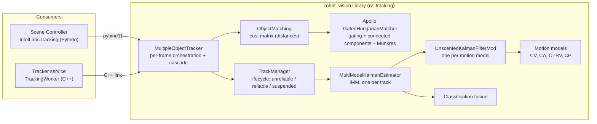
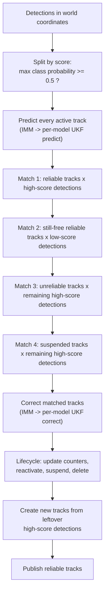
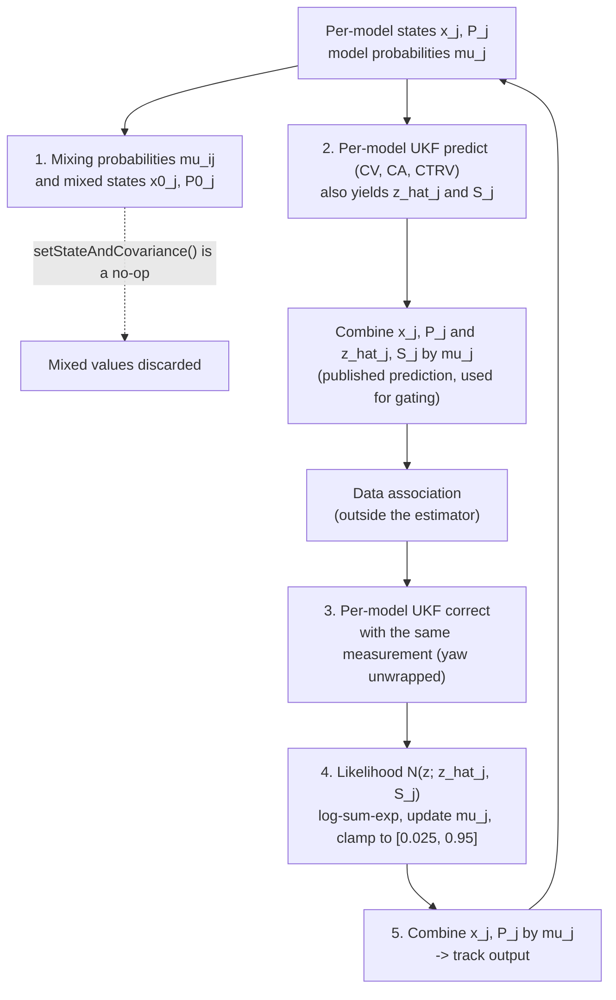
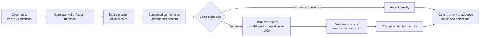
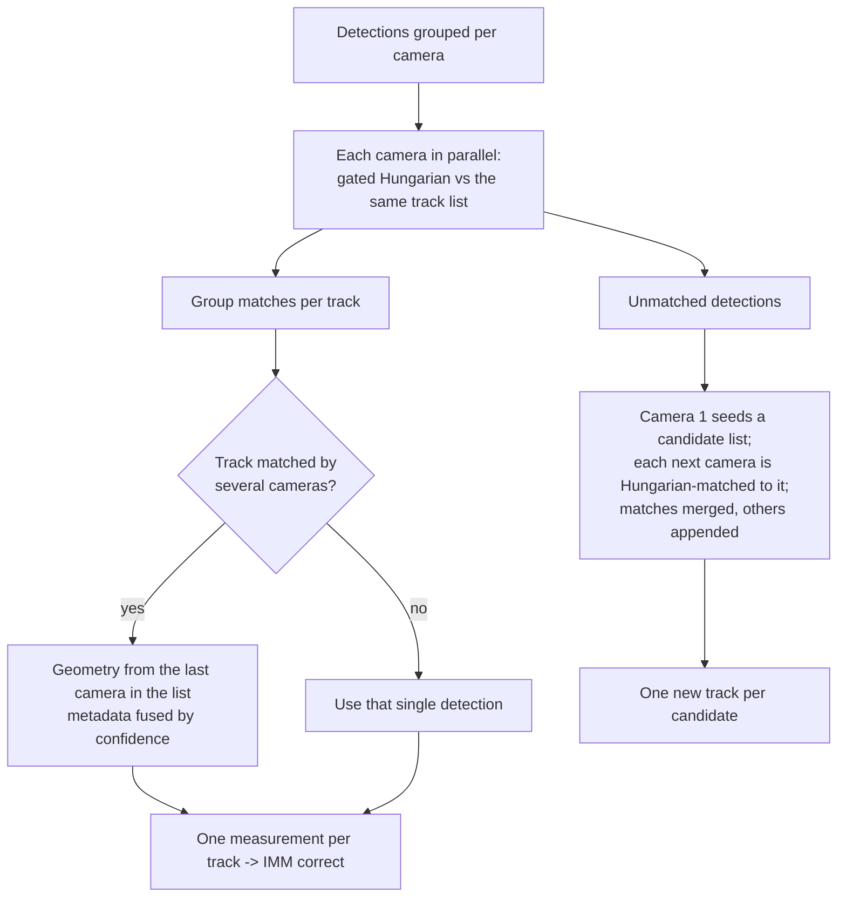
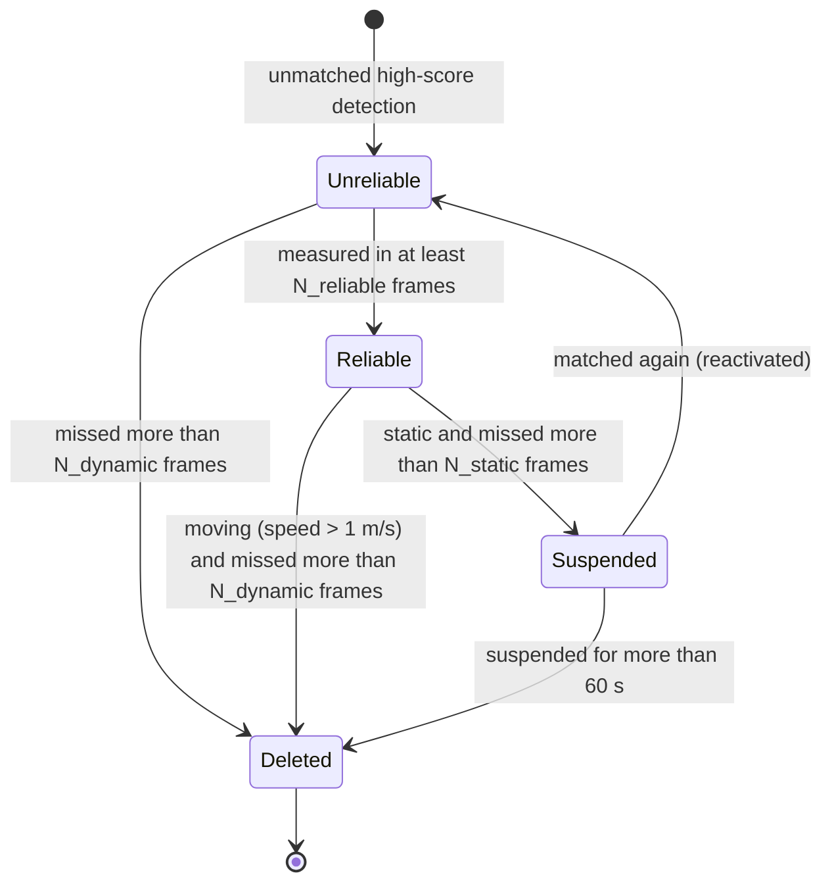

<!--
SPDX-FileCopyrightText: (C) 2026 Intel Corporation
SPDX-License-Identifier: Apache-2.0
-->

# Robot Vision Tracking: Algorithms Analysis

| Item            | Value                                                                                                                                                       |
| --------------- | ----------------------------------------------------------------------------------------------------------------------------------------------------------- |
| Branch          | `main`                                                                                                                                                      |
| Commit          | `d6bccbc0f30b7606fa864bff7dcb0a97c09e8e21` (2026-09-23)                                                                                                     |
| Scope           | C++ library `rv::tracking` in [controller/src/robot_vision](../../controller/src/robot_vision) and how its two consumers configure it                       |
| Consumers       | Scene Controller ([ilabs_tracking.py](../../controller/src/controller/ilabs_tracking.py)) and Tracker service ([tracking_worker.cpp](../../tracker/src/tracking_worker.cpp)) |
| Out of scope    | ReID / UUID management in the controller Python layer, camera undistortion helpers ([CameraUtils.cpp](../../controller/src/robot_vision/src/rv/tracking/CameraUtils.cpp)) |

All source links are relative to this folder (`docs/development/`) and line numbers refer to the commit above.

## 1. Summary

The tracker is a **multi-object tracker (MOT)** built from four layers:

1. **State estimation** – every track owns an **Interacting Multiple Model (IMM)** estimator. Each IMM runs one
   **Unscented Kalman Filter (UKF)** per motion model (**CV**, **CA**, **CTRV**; **CP** is optional).
2. **Data association** – a cost matrix (Euclidean, class-aware Euclidean, or Mahalanobis distance) is solved by the
   **Apollo gated Hungarian matcher** (gating + connected-component split + Kuhn–Munkres).
3. **Association strategy** – a **matching cascade**: reliable tracks first, then tentative, then suspended ones, with a
   ByteTrack-like high/low detection-score split and a multi-camera batching mode.
4. **Track lifecycle** – tentative ("unreliable") → confirmed ("reliable") → deleted or suspended/reactivated.

| Stage            | Algorithm                                       | Problem it solves                                                            | Classic or customized                                                                                                       |
| ---------------- | ----------------------------------------------- | ---------------------------------------------------------------------------- | --------------------------------------------------------------------------------------------------------------------------- |
| Filter           | Unscented Kalman Filter (scaled UT)             | Estimate position/velocity/size/yaw from noisy detections, nonlinear motion  | **Classic**, copied from OpenCV contrib, with a small **structural change** (measurement prediction moved into `predict()`) |
| Motion           | CV, CA, CP kinematic models                     | Describe "straight", "accelerating", "standing" motion                       | **Classic** equations inside a shared 12-D state                                                                             |
| Motion           | CTRV (constant turn rate and velocity)          | Describe turning motion                                                      | **Classic** equations, **custom** Cartesian-velocity parametrization                                                         |
| Multiple models  | IMM estimator                                   | Handle objects that switch between motion styles                             | **Classic structure, customized**; mixing step is ineffective (see [5.3.4](#534-finding-the-mixing-step-has-no-effect))     |
| Cost             | Euclidean / multi-class Euclidean / Mahalanobis | Measure how well a detection fits a track                                    | Euclidean classic; others **custom** variants                                                                               |
| Matching         | Gated Hungarian (Apollo)                        | One-to-one detection-to-track pairing with minimum total cost                 | **Classic** Munkres + Apollo engineering (gating, graph split); vendored almost verbatim                                   |
| Strategy         | Matching cascade + score split                  | Protect established tracks, reduce ID switches, handle low-confidence boxes  | **Custom** composition of DeepSORT-style cascade and ByteTrack-style two-stage matching                                     |
| Multi-camera     | Per-camera matching + birth clustering          | Combine several cameras observing the same scene                             | **Custom**                                                                                                                  |
| Lifecycle        | M-of-N confirmation, miss-count deletion        | Suppress false positives, drop lost objects                                  | **Classic** idea (SORT/DeepSORT) + **custom** static/dynamic handling and suspension                                         |
| Class fusion     | Normalized product of class probabilities       | Accumulate class evidence over time                                          | **Custom** (naive-Bayes-like with "unknown" mass)                                                                           |

Key findings (details in [Section 9](#9-observations-and-potential-issues)):

- The IMM **mixing (interaction) step is computed but never applied** because `setStateAndCovariance()` is a no-op
  (parameter shadowing, verified by compiling with `-Wshadow` and by a runtime check). The estimator therefore behaves
  as a **bank of independent UKFs blended by adaptive weights**, not as a true IMM.
- The model-probability update ignores the Markov transition matrix, so the transition matrix has no effect on outputs.
- The UKF inherits an OpenCV cross-covariance quirk that slows velocity convergence (measured below).
- Production callers use plain 2-D **Euclidean** distance, and the way they fill class probabilities makes the
  ByteTrack-like **low-score stage inactive**.

## 2. Where the Code Lives

| Component                  | Header                                                                                                          | Implementation                                                                                                           |
| -------------------------- | --------------------------------------------------------------------------------------------------------------- | ------------------------------------------------------------------------------------------------------------------------ |
| Tracked object / state     | [TrackedObject.hpp](../../controller/src/robot_vision/include/rv/tracking/TrackedObject.hpp)                    | [TrackedObject.cpp](../../controller/src/robot_vision/src/rv/tracking/TrackedObject.cpp)                                 |
| UKF                        | [UnscentedKalmanFilter.hpp](../../controller/src/robot_vision/include/rv/tracking/UnscentedKalmanFilter.hpp)    | [UnscentedKalmanFilter.cpp](../../controller/src/robot_vision/src/rv/tracking/UnscentedKalmanFilter.cpp)                 |
| Motion models              | [CVModel.hpp](../../controller/src/robot_vision/include/rv/tracking/CVModel.hpp), [CAModel.hpp](../../controller/src/robot_vision/include/rv/tracking/CAModel.hpp), [CTRVModel.hpp](../../controller/src/robot_vision/include/rv/tracking/CTRVModel.hpp), [CPModel.hpp](../../controller/src/robot_vision/include/rv/tracking/CPModel.hpp) | [CVModel.cpp](../../controller/src/robot_vision/src/rv/tracking/CVModel.cpp), [CAModel.cpp](../../controller/src/robot_vision/src/rv/tracking/CAModel.cpp), [CTRVModel.cpp](../../controller/src/robot_vision/src/rv/tracking/CTRVModel.cpp), [CPModel.cpp](../../controller/src/robot_vision/src/rv/tracking/CPModel.cpp) |
| IMM estimator              | [MultiModelKalmanEstimator.hpp](../../controller/src/robot_vision/include/rv/tracking/MultiModelKalmanEstimator.hpp) | [MultiModelKalmanEstimator.cpp](../../controller/src/robot_vision/src/rv/tracking/MultiModelKalmanEstimator.cpp)     |
| Distances + matching entry | [ObjectMatching.hpp](../../controller/src/robot_vision/include/rv/tracking/ObjectMatching.hpp)                  | [ObjectMatching.cpp](../../controller/src/robot_vision/src/rv/tracking/ObjectMatching.cpp)                               |
| Gated Hungarian (Apollo)   | [gated_hungarian_bigraph_matcher.hpp](../../controller/src/robot_vision/include/rv/apollo/gated_hungarian_bigraph_matcher.hpp), [hungarian_optimizer.hpp](../../controller/src/robot_vision/include/rv/apollo/hungarian_optimizer.hpp) | [multi_hm_bipartite_graph_matcher.cpp](../../controller/src/robot_vision/src/rv/apollo/multi_hm_bipartite_graph_matcher.cpp), [connected_component_analysis.cpp](../../controller/src/robot_vision/src/rv/apollo/connected_component_analysis.cpp) |
| Track lifecycle            | [TrackManager.hpp](../../controller/src/robot_vision/include/rv/tracking/TrackManager.hpp)                      | [TrackManager.cpp](../../controller/src/robot_vision/src/rv/tracking/TrackManager.cpp)                                   |
| Per-frame orchestration    | [MultipleObjectTracker.hpp](../../controller/src/robot_vision/include/rv/tracking/MultipleObjectTracker.hpp)    | [MultipleObjectTracker.cpp](../../controller/src/robot_vision/src/rv/tracking/MultipleObjectTracker.cpp)                 |
| ID-based tracker           | [TrackTracker.hpp](../../controller/src/robot_vision/include/rv/tracking/TrackTracker.hpp)                      | [TrackTracker.cpp](../../controller/src/robot_vision/src/rv/tracking/TrackTracker.cpp)                                   |
| Class probabilities        | [Classification.hpp](../../controller/src/robot_vision/include/rv/tracking/Classification.hpp)                  | [Classification.cpp](../../controller/src/robot_vision/src/rv/tracking/Classification.cpp)                               |
| Angle helpers              | [Utils.hpp](../../controller/src/robot_vision/include/rv/Utils.hpp)                                             | –                                                                                                                        |
| Python bindings            | –                                                                                                               | [extensions/tracking.cpp](../../controller/src/robot_vision/python/src/robot_vision/extensions/tracking.cpp)             |

How the consumers configure the library:

| Setting                  | Library default ([TrackManager.hpp](../../controller/src/robot_vision/include/rv/tracking/TrackManager.hpp#L18-L35)) | Scene Controller ([ilabs_tracking.py](../../controller/src/controller/ilabs_tracking.py#L63-L85)) | Tracker service ([tracking_worker.cpp](../../tracker/src/tracking_worker.cpp#L73-L92)) |
| ------------------------ | ---------------------------- | -------------------------------------------------------- | ----------------------------------------------------- |
| Process noise `q`        | `1e-3`                       | `1e-4`                                                   | `1e-4`                                                |
| Measurement noise `r`    | `1e-2`                       | `0.2`                                                    | `0.2`                                                 |
| Initial covariance       | `1.0`                        | `1.0`                                                    | `1.0`                                                 |
| Motion models            | CV, CA, CTRV                 | CV, CA, CTRV                                             | CV, CA, CTRV                                          |
| Distance type            | `MultiClassEuclidean`        | `Euclidean` ([L162](../../controller/src/controller/ilabs_tracking.py#L162))           | `Euclidean` ([L310](../../tracker/src/tracking_worker.cpp#L310))  |
| Distance threshold       | `5.0`                        | mean `tracking_radius` of the frame's objects (default 2.0 m, per class) | `2.0` m ([L31](../../tracker/src/tracking_worker.cpp#L31))        |
| Class probability vector | –                            | `[confidence, 1 - confidence]` ([L99-L101](../../controller/src/controller/ilabs_tracking.py#L99-L101)) | not set, default `[1.0]`                              |

## 3. High-Level Architecture

### 3.1 Component view



### 3.2 One tracking cycle (single camera)

Implemented in [MultipleObjectTracker::track](../../controller/src/robot_vision/src/rv/tracking/MultipleObjectTracker.cpp#L206-L260).



Every "Match" box is one call to the gated Hungarian matcher ([Section 6.2](#62-gated-hungarian-matcher-apollo)).

## 4. What Is Being Estimated

In simple terms: each track stores "where the object is, how fast and in which direction it moves, how big it is,
and how it is rotated". Detections only report position, size and yaw; speed and acceleration must be inferred.

- **State** (12 values, [TrackedObject.cpp](../../controller/src/robot_vision/src/rv/tracking/TrackedObject.cpp#L9-L10)):
  $[x, y, v_x, v_y, a_x, a_y, z, l, w, h, \psi, \omega]$ – position, velocity, acceleration, height, size, yaw, turn rate.
- **Measurement** (7 values): $[x, y, z, l, w, h, \psi]$.
- **Measurement function** $h(\cdot)$ is **linear** (it just selects 7 of the 12 state entries), identical in all models,
  for example [CVModel.cpp](../../controller/src/robot_vision/src/rv/tracking/CVModel.cpp#L41-L51).
- **Noise**: $Q = q\,I_{12}$ and $R = r\,I_7$ ([MultiModelKalmanEstimator.cpp](../../controller/src/robot_vision/src/rv/tracking/MultiModelKalmanEstimator.cpp#L81-L82)).

## 5. Kalman Filtering

### 5.1 Unscented Kalman Filter (UKF)

**In simple terms.** A Kalman filter is a *predict, then correct* loop: predict where the object should be now, then
blend that guess with the new detection, trusting whichever is less noisy. Classic Kalman filters need straight-line
(linear) equations. The UKF handles curved motion (like turning) by picking a small cloud of 25 sample points
("sigma points") around the current guess, moving each point through the motion equation, and measuring the new
center and spread of the cloud.

**Problem it solves.** Optimal-ish state estimation for nonlinear motion (CTRV) without computing Jacobians.

**Implementation.** `UnscentedKalmanFilterMod` in
[UnscentedKalmanFilter.hpp](../../controller/src/robot_vision/include/rv/tracking/UnscentedKalmanFilter.hpp#L53) is a
copy of OpenCV contrib's `UnscentedKalmanFilterImpl` (the file keeps the OpenCV copyright line):

- Sigma points $\mathcal{X}_0 = \hat{x}$, $\mathcal{X}_{i} = \hat{x} \pm \sqrt{n+\lambda}\,L_i$ with $L = \operatorname{chol}(P)$
  ([L102-L130](../../controller/src/robot_vision/src/rv/tracking/UnscentedKalmanFilter.cpp#L102-L130)).
- Scaled-UT weights ([L53-L69](../../controller/src/robot_vision/src/rv/tracking/UnscentedKalmanFilter.cpp#L53-L69)):

$$
\lambda = \alpha^2 (n+\kappa) - n,\quad
W_0^{m} = \frac{\lambda}{n+\lambda},\quad
W_0^{c} = W_0^{m} + 1 - \alpha^2 + \beta,\quad
W_i^{m} = W_i^{c} = \frac{1}{2(n+\lambda)}
$$

- Parameters used: $\alpha = 1$, $\beta = 2$, $\kappa = 3 - n$
  ([MultiModelKalmanEstimator.cpp L14-L22](../../controller/src/robot_vision/src/rv/tracking/MultiModelKalmanEstimator.cpp#L14-L22)).
  With $n = 12$: $\lambda = -9$, $n+\lambda = 3$, $W_0^m = -3$, $W_0^c = -1$, $W_i = 1/6$.
- **Predict** ([L132-L186](../../controller/src/robot_vision/src/rv/tracking/UnscentedKalmanFilter.cpp#L132-L186)):
  propagate sigma points through $f$, compute $\hat{x}^-$ and $P^- = \sum W^c (\cdot)(\cdot)^T + Q$, **then also** redraw
  sigma points, push them through $h$, and compute $\hat{z}$ and the innovation covariance $S$.
- **Correct** ([L189-L208](../../controller/src/robot_vision/src/rv/tracking/UnscentedKalmanFilter.cpp#L189-L208)):
  $P_{xz}$, $K = P_{xz} S^{-1}$ (SVD inverse), $\hat{x} = \hat{x}^- + K(z - \hat{z})$, $P = P^- - K P_{xz}^T$.

**Classic vs customized.**

| Aspect                         | Classic (OpenCV contrib `unscented_kalman.cpp`)        | This implementation                                                                                                                                                                               |
| ------------------------------ | ------------------------------------------------------ | ------------------------------------------------------------------------------------------------------------------------------------------------------------------------------------------------- |
| Sigma points, weights, update  | Scaled UT, additive noise                              | **Same** (verbatim copy)                                                                                                                                                                          |
| Where $\hat{z}$ and $S$ are computed | Inside `correct()`                                | **Moved into `predict()`** ([L159](../../controller/src/robot_vision/src/rv/tracking/UnscentedKalmanFilter.cpp#L159-L183)) so $S$ is known *before* a measurement is chosen – needed for Mahalanobis gating and IMM likelihoods |
| Extra API                      | –                                                      | `getMeasurementCov()` returns $S$ ([hpp L118](../../controller/src/robot_vision/include/rv/tracking/UnscentedKalmanFilter.hpp#L118)); `setStateAndCovariance()` ([hpp L120-L124](../../controller/src/robot_vision/include/rv/tracking/UnscentedKalmanFilter.hpp#L120-L124)) – **does nothing**, see [5.3.4](#534-finding-the-mixing-step-has-no-effect) |
| Parameters                     | OpenCV default $\alpha = 10^{-3}$, $\kappa = 0$, $\beta = 2$ | Julier's original heuristic $n + \kappa = 3$ with $\alpha = 1$; gives **negative** center weights                                                                                            |
| Process noise                  | Model-specific                                         | Isotropic constant $q\,I$, **not scaled with $\Delta t$**                                                                                                                                         |
| $P_{xz}$ cross-covariance      | Mixes two different sigma-point sets (upstream quirk) | **Inherited unchanged** ([L194](../../controller/src/robot_vision/src/rv/tracking/UnscentedKalmanFilter.cpp#L194)), see [Section 9](#9-observations-and-potential-issues)                           |

Verdict: **classic UKF** with a **small structural customization** (early measurement prediction) to feed the
association and IMM stages.

### 5.2 Motion Models

**In simple terms.** A motion model is a rule for "where will the object be $\Delta t$ seconds from now?". Each rule
fits a different behavior.

| Model | Rule (simple)                              | Equations                                                                                         | Source                                                                                        |
| ----- | ------------------------------------------ | ------------------------------------------------------------------------------------------------- | --------------------------------------------------------------------------------------------- |
| CV    | Keeps moving in a straight line, same speed | $p' = p + v\Delta t$, $v' = v$, $a' = 0$, $\omega' = 0$                                            | [CVModel.cpp L9-L39](../../controller/src/robot_vision/src/rv/tracking/CVModel.cpp#L9-L39)     |
| CA    | Keeps accelerating the same way             | $p' = p + v\Delta t + \tfrac12 a\Delta t^2$, $v' = v + a\Delta t$, $a' = a$, $\omega' = 0$         | [CAModel.cpp L9-L42](../../controller/src/robot_vision/src/rv/tracking/CAModel.cpp#L9-L42)     |
| CTRV  | Keeps turning at the same rate, same speed  | see below                                                                                         | [CTRVModel.cpp L9-L60](../../controller/src/robot_vision/src/rv/tracking/CTRVModel.cpp#L9-L60) |
| CP    | Stands still (optional, not used by default) | $p' = p$, $v' = a' = 0$, $\omega' = 0$                                                            | [CPModel.cpp L9-L32](../../controller/src/robot_vision/src/rv/tracking/CPModel.cpp#L9-L32)     |

In every model $z$, $l$, $w$, $h$ and yaw $\psi$ stay constant (they only change through process noise).

CTRV ([L27-L48](../../controller/src/robot_vision/src/rv/tracking/CTRVModel.cpp#L27-L48)), with speed
$v = \sqrt{v_x^2 + v_y^2}$ and heading $\theta = \operatorname{atan2}(v_y, v_x)$:

$$
x' = x + \frac{v}{\omega}\big[\sin(\theta + \omega\Delta t) - \sin\theta\big],\quad
y' = y + \frac{v}{\omega}\big[\cos\theta - \cos(\theta + \omega\Delta t)\big],\quad
v_x' = v\cos(\theta+\omega\Delta t),\quad v_y' = v\sin(\theta+\omega\Delta t)
$$

For $|\omega| < 10^{-3}$ a straight-line limit is used.

**Classic vs customized.**

- CV, CA, CP: **classic** kinematics. Embedding them in one common 12-D state (unused derivatives forced to zero) is the
  standard way to make heterogeneous models mixable in an IMM.
- CTRV: position equations are the **classic** CTRV (Schubert et al., 2008, cited in
  [CTRVModel.hpp](../../controller/src/robot_vision/include/rv/tracking/CTRVModel.hpp)). **Customization:** the classic
  state is $[x, y, \theta, v, \omega]$; here the state keeps Cartesian $v_x, v_y$ and derives $\theta$ from the velocity
  direction. Object yaw $\psi$ is a separate state that CTRV does not rotate, and $\omega$ is never measured – it is only
  learned through cross-covariances.

### 5.3 Interacting Multiple Model (IMM) Estimator

**In simple terms.** Objects do not always move the same way – a person walks straight, stops, then turns. Instead of
picking one motion rule, the IMM runs **several filters side by side** (one per rule). After each detection it checks
which filter predicted it best and gives that filter more weight. The published track is the weighted average.

**Problem it solves.** Tracking maneuvering targets whose motion regime changes over time (Blom & Bar-Shalom, 1988).

**Implementation.** `MultiModelKalmanEstimator` in
[MultiModelKalmanEstimator.cpp](../../controller/src/robot_vision/src/rv/tracking/MultiModelKalmanEstimator.cpp). One
estimator is created per track; one `UnscentedKalmanFilterMod` is created per motion model
([L75-L90](../../controller/src/robot_vision/src/rv/tracking/MultiModelKalmanEstimator.cpp#L75-L90)).

#### 5.3.1 IMM cycle as implemented



#### 5.3.2 Step-by-step: classic IMM vs this code

| Step                     | Classic IMM                                                                                                                         | This implementation                                                                                                                                                                                                                                             | Verdict                  |
| ------------------------ | ----------------------------------------------------------------------------------------------------------------------------------- | --------------------------------------------------------------------------------------------------------------------------------------------------------------------------------------------------------------------------------------------------------------- | ------------------------ |
| Transition matrix $\Pi$  | Designer-chosen Markov matrix                                                                                                       | 0.05 off-diagonal, $1 - (N-1)\cdot 0.05$ on the diagonal (0.9 for 3 models) ([L69-L73](../../controller/src/robot_vision/src/rv/tracking/MultiModelKalmanEstimator.cpp#L69-L73))                                                                                  | Classic                  |
| 1a. Mixing probabilities | $\bar c_j = \sum_i p_{ij}\mu_i$, $\mu_{i\mid j} = p_{ij}\mu_i / \bar c_j$                                                            | Same ([L290-L312](../../controller/src/robot_vision/src/rv/tracking/MultiModelKalmanEstimator.cpp#L290-L312))                                                                                                                                                     | Classic                  |
| 1b. Mixing (interaction) | $\hat x_{0j} = \sum_i \mu_{i\mid j}\hat x_i$, $P_{0j} = \sum_i \mu_{i\mid j}[P_i + (\hat x_i - \hat x_{0j})(\cdot)^T]$, then **re-initialize filter $j$** | Formulas identical ([L314-L349](../../controller/src/robot_vision/src/rv/tracking/MultiModelKalmanEstimator.cpp#L314-L349)), but the re-initialization call ([L174](../../controller/src/robot_vision/src/rv/tracking/MultiModelKalmanEstimator.cpp#L174)) has no effect | **Broken** (see 5.3.4)   |
| 2. Mode-matched filters  | Usually KF / EKF                                                                                                                    | UKF per model                                                                                                                                                                                                                                                   | Known variant (IMM-UKF)  |
| Predicted output         | Optional                                                                                                                            | Moment-matched combination of $\hat x_j$ and **also of $\hat z_j$, $S_j$** for association ([L185-L221](../../controller/src/robot_vision/src/rv/tracking/MultiModelKalmanEstimator.cpp#L185-L221))                                                             | Custom extension         |
| Measurement pre-processing | –                                                                                                                                 | Yaw measurement unwrapped around the previous yaw with 180° ambiguity ([L252](../../controller/src/robot_vision/src/rv/tracking/MultiModelKalmanEstimator.cpp#L252), [Utils.hpp L47-L60](../../controller/src/robot_vision/include/rv/Utils.hpp#L47-L60))           | Custom                   |
| 3. Likelihood            | $\Lambda_j = \mathcal{N}(z;\hat z_j, S_j)$                                                                                          | Same, computed in log space, normalized with log-sum-exp ([L376-L418](../../controller/src/robot_vision/src/rv/tracking/MultiModelKalmanEstimator.cpp#L376-L418))                                                                                                 | Classic, numerically safer |
| 4. Mode probability      | $\mu_j = \Lambda_j \bar c_j / \sum_k \Lambda_k \bar c_k$                                                                            | $\mu_j = \Lambda_j \mu_j^{\text{prev}} / \sum_k \Lambda_k \mu_k^{\text{prev}}$ – uses **previous** $\mu$ instead of predicted $\bar c_j$ ([L430](../../controller/src/robot_vision/src/rv/tracking/MultiModelKalmanEstimator.cpp#L430))                         | **Deviation**            |
| Probability bounds       | None                                                                                                                                | Affine rescale $\mu_j \leftarrow \mu_j(\mu_{\max} - \mu_{\min}) + \mu_{\min}$ with $\mu_{\max} = 0.95$, $\mu_{\min} = 0.05/(N-1)$ ([L62-L63](../../controller/src/robot_vision/src/rv/tracking/MultiModelKalmanEstimator.cpp#L62-L63), [L371-L374](../../controller/src/robot_vision/src/rv/tracking/MultiModelKalmanEstimator.cpp#L371-L374), [L433](../../controller/src/robot_vision/src/rv/tracking/MultiModelKalmanEstimator.cpp#L433)) | Custom (keeps every model "alive"; sums stay 1) |
| 5. Combination           | $\hat x = \sum_j \mu_j \hat x_j$, $P = \sum_j \mu_j[P_j + (\hat x_j - \hat x)(\cdot)^T]$                                          | Same ([L437-L460](../../controller/src/robot_vision/src/rv/tracking/MultiModelKalmanEstimator.cpp#L437-L460))                                                                                                                                                     | Classic                  |
| Class fusion             | –                                                                                                                                   | Class probabilities fused on every correction ([L284](../../controller/src/robot_vision/src/rv/tracking/MultiModelKalmanEstimator.cpp#L284))                                                                                                                      | Custom add-on            |
| Single model             | –                                                                                                                                   | Shortcut: plain UKF ([L94-L123](../../controller/src/robot_vision/src/rv/tracking/MultiModelKalmanEstimator.cpp#L94-L123), [L230-L242](../../controller/src/robot_vision/src/rv/tracking/MultiModelKalmanEstimator.cpp#L230-L242))                                | Custom convenience       |

#### 5.3.3 Why the extra "combined $\hat z$, $S$" matters

The combined innovation covariance is stored in the track as `predictedMeasurementCov` / `predictedMeasurementCovInv`
([L219-L221](../../controller/src/robot_vision/src/rv/tracking/MultiModelKalmanEstimator.cpp#L219-L221)) and is what
the Mahalanobis distance uses ([Section 6.1](#61-cost-functions-distances)). This is why the UKF was modified to compute
$S$ in `predict()`.

#### 5.3.4 Finding: the mixing step has no effect

```cpp
// UnscentedKalmanFilter.hpp L120-L124
void setStateAndCovariance(cv::Mat state, cv::Mat errorCov)
{
  state = state.clone();       // assigns the parameter to itself
  errorCov = errorCov.clone(); // member variables are untouched
}
```

The parameters have the same names as the members, so the members are never written
([UnscentedKalmanFilter.hpp L120-L124](../../controller/src/robot_vision/include/rv/tracking/UnscentedKalmanFilter.hpp#L120-L124)).
Verified two ways:

- `g++ -Wshadow` reports "declaration of 'state' shadows a member" for this function.
- A small program that calls `setStateAndCovariance(42·1, 7·I)` and then reads the filter back gets the original
  values (`state[0] = 0`, `P[0,0] = 1`).

Consequences:

- Each UKF keeps running on its **own** previous estimate; the mixed initial conditions are thrown away.
- Together with the probability update that skips $\Pi$ (step 4 above), the **transition matrix has no influence** on
  any output; it only appears in the diagnostic `conditional_probability` property.
- The effective algorithm is a **static multiple-model estimator** (a bank of independent filters with Bayesian
  weights, Magill 1965), made adaptive by the probability clamp – not a true IMM.

Verdict: **classic IMM design, customized** (UKF, log-sum-exp, probability clamp, combined measurement prediction, yaw
unwrapping), but with a defect that disables the defining IMM feature.

## 6. Data Association (Matching)

**In simple terms.** Every frame produces a list of tracks and a list of detections. Matching answers "which detection
belongs to which track?". First a table of distances is built (every track vs every detection). Pairs that are too far
apart are forbidden ("gating"). The remaining puzzle is solved so that each track gets at most one detection, each
detection at most one track, and the total distance is as small as possible.

### 6.1 Cost Functions (Distances)

Defined in [ObjectMatching.cpp](../../controller/src/robot_vision/src/rv/tracking/ObjectMatching.cpp). The cost matrix
is filled in parallel with OpenMP ([L108-L115](../../controller/src/robot_vision/src/rv/tracking/ObjectMatching.cpp#L108-L115)).

| `DistanceType`        | Formula                                                                                                                                        | Source                                                                                                     | Classic?                                                                          |
| --------------------- | ---------------------------------------------------------------------------------------------------------------------------------------------- | ---------------------------------------------------------------------------------------------------------- | --------------------------------------------------------------------------------- |
| `Euclidean`           | $d = \lVert p^{xy}_{\text{det}} - p^{xy}_{\text{trk}} \rVert$ (predicted track position)                                                       | [L28-L31](../../controller/src/robot_vision/src/rv/tracking/ObjectMatching.cpp#L28-L31)                    | Classic; **used in production**                                                   |
| `MultiClassEuclidean` | $d = \lVert \Delta p^{xy} \rVert \cdot (1 + c)$, $c = \sqrt{\tfrac12 \lVert \pi_{\text{det}} - \pi_{\text{trk}} \rVert^2} \in [0, 1]$           | [L19-L26](../../controller/src/robot_vision/src/rv/tracking/ObjectMatching.cpp#L19-L26), [Classification.cpp L27-L37](../../controller/src/robot_vision/src/rv/tracking/Classification.cpp#L27-L37) | Custom: class disagreement can double the distance; library default               |
| `Mahalanobis`         | $d = \tfrac12\sqrt{\nu^T S^{-1}\nu}$, $\nu = z - \hat z$ over all 7 measurements, yaw component of $\nu$ set to 0                             | [L33-L43](../../controller/src/robot_vision/src/rv/tracking/ObjectMatching.cpp#L33-L43)                    | Custom variant: factor ½, includes size and height, yaw zeroed (2-D detectors have no yaw) |
| `MCEMahalanobis`      | $d = 0.5\,d_{\text{MCE}} + 0.5\,d_{\text{Mah}}$                                                                                                | [L45-L51](../../controller/src/robot_vision/src/rv/tracking/ObjectMatching.cpp#L45-L51)                    | Custom blend                                                                      |

### 6.2 Gated Hungarian Matcher (Apollo)

**In simple terms.** The Hungarian (Kuhn–Munkres) algorithm is the textbook way to solve "assign N workers to M jobs at
minimum total cost". Apollo's wrapper adds two practical tricks: forbid pairs above a threshold, and split the big table
into small independent groups that can be solved separately, which is much faster in crowded scenes.

**Problem it solves.** Globally optimal one-to-one assignment (instead of greedy nearest-neighbor), with a hard gate.



| Step                    | Source                                                                                                                                                                             |
| ----------------------- | ---------------------------------------------------------------------------------------------------------------------------------------------------------------------------------- |
| Entry point, options    | [ObjectMatching.cpp L53-L118](../../controller/src/robot_vision/src/rv/tracking/ObjectMatching.cpp#L53-L118), [multi_hm_bipartite_graph_matcher.cpp L22-L30](../../controller/src/robot_vision/src/rv/apollo/multi_hm_bipartite_graph_matcher.cpp#L22-L30) |
| Gate (`cost < thresh`)  | [gated_hungarian_bigraph_matcher.hpp L184](../../controller/src/robot_vision/include/rv/apollo/gated_hungarian_bigraph_matcher.hpp#L184)                                           |
| Connected components    | [gated_hungarian_bigraph_matcher.hpp L191-L231](../../controller/src/robot_vision/include/rv/apollo/gated_hungarian_bigraph_matcher.hpp#L191-L231), [connected_component_analysis.cpp L11-L48](../../controller/src/robot_vision/src/rv/apollo/connected_component_analysis.cpp#L11-L48) |
| 1×1 shortcut            | [gated_hungarian_bigraph_matcher.hpp L247-L256](../../controller/src/robot_vision/include/rv/apollo/gated_hungarian_bigraph_matcher.hpp#L247-L256)                                 |
| Bound value for invalid | [gated_hungarian_bigraph_matcher.hpp L314-L335](../../controller/src/robot_vision/include/rv/apollo/gated_hungarian_bigraph_matcher.hpp#L314-L335)                                 |
| Post-filter             | [gated_hungarian_bigraph_matcher.hpp L272](../../controller/src/robot_vision/include/rv/apollo/gated_hungarian_bigraph_matcher.hpp#L272)                                           |
| Munkres (steps 1–6)     | [hungarian_optimizer.hpp L551](../../controller/src/robot_vision/include/rv/apollo/hungarian_optimizer.hpp#L551), zero padding [L301-L357](../../controller/src/robot_vision/include/rv/apollo/hungarian_optimizer.hpp#L301-L357) |

**Classic vs customized.**

- Hungarian optimizer: **classic** Munkres (6-step star/prime/cover algorithm, $O(n^3)$), rectangular problems handled
  by zero padding.
- Gating with a large "bound value" and connected-component decomposition: **Apollo engineering enhancements** (Baidu
  Apollo lidar perception, `MultiHmBipartiteGraphMatcher`). Vendored nearly verbatim; the only local change is disabling
  glog `CHECK` macros ([L13-L16](../../controller/src/robot_vision/include/rv/apollo/gated_hungarian_bigraph_matcher.hpp#L13-L16)).
  The decomposition does not change the result: pairs that fail the gate never link two components.

### 6.3 Matching Cascade and Score Split

**In simple terms.** Not all tracks are equally trustworthy. Established ("reliable") tracks get the first pick of
detections, then new ("unreliable") tracks, then "sleeping" (suspended) tracks. Low-confidence detections are only used
to keep established tracks alive, never to start new ones.

Order in [MultipleObjectTracker.cpp L206-L260](../../controller/src/robot_vision/src/rv/tracking/MultipleObjectTracker.cpp#L206-L260):

| # | Tracks                  | Detections                        | Purpose                                                  |
| - | ----------------------- | --------------------------------- | -------------------------------------------------------- |
| 1 | Reliable                | High score ($\max\pi \ge 0.5$)    | Keep confirmed identities stable                         |
| 2 | Reliable, still free    | Low score                         | Recover occluded / low-confidence objects (BYTE idea)    |
| 3 | Unreliable (tentative)  | Remaining high score              | Confirm new tracks                                       |
| 4 | Suspended               | Remaining high score              | Re-identify parked static objects                        |
| – | New tracks              | Remaining high score              | Birth; unmatched low-score detections are dropped        |

The score split is in [splitByThreshold](../../controller/src/robot_vision/src/rv/tracking/MultipleObjectTracker.cpp#L157-L171).

**Classic vs customized.** **Custom composition** of two known ideas: the state-ordered *matching cascade* of DeepSORT
(Wojke et al., 2017) and the high/low two-stage association of ByteTrack (Zhang et al., 2022). Unlike ByteTrack, lost
(suspended) tracks are matched last instead of first. Note that both production callers make the low-score stage empty
(see [Section 9](#9-observations-and-potential-issues)).

### 6.4 Multi-Camera (Batched) Mode

Used when detections of several cameras arrive together (controller batched mode, and always in the Tracker service).
Implemented in [MultipleObjectTracker.cpp L264-L345](../../controller/src/robot_vision/src/rv/tracking/MultipleObjectTracker.cpp#L264-L345)
and [L354-L440](../../controller/src/robot_vision/src/rv/tracking/MultipleObjectTracker.cpp#L354-L440).



**In simple terms.** Every camera is matched to the tracks on its own. If two cameras see the same object, only one
camera's position is used to correct the track (the last one in the list); the other is discarded rather than averaged.
Leftover detections from different cameras that are close to each other become one new track instead of duplicates.

**Classic vs customized.** **Custom.** It is not a classic multi-sensor fusion (no sequential or joint update with all
matched measurements); it is a de-duplication scheme
([L315-L321](../../controller/src/robot_vision/src/rv/tracking/MultipleObjectTracker.cpp#L315-L321),
[L397-L437](../../controller/src/robot_vision/src/rv/tracking/MultipleObjectTracker.cpp#L397-L437)).

### 6.5 ID-Based Tracker

[TrackTracker::track](../../controller/src/robot_vision/src/rv/tracking/TrackTracker.cpp#L12-L48) skips matching and
associates by the incoming object ID (for inputs that are already tracked). It reuses the same `TrackManager` and IMM.
It is exposed in Python but not used by the controller or the Tracker service.

## 7. Track Lifecycle Management

**In simple terms.** A new track must be seen a few times before it is trusted. A trusted track that disappears is
deleted quickly if it was moving, but "parked" for a while if it was standing still, so it can resume its old identity
when it is seen again.



- Frame thresholds are derived from time settings: $N = \lceil \text{fps} \cdot t \rceil$ for `max_unreliable_time`
  (0.3333 s), `non_measurement_time_dynamic` (0.2666 s) and `non_measurement_time_static` (0.5333 s)
  ([TrackManager.cpp L351-L356](../../controller/src/robot_vision/src/rv/tracking/TrackManager.cpp#L351-L356)).
  At 15 fps this gives 5, 4 and 8 frames.
- "Dynamic" means speed above 1 m/s ([TrackedObject.cpp L31-L34](../../controller/src/robot_vision/src/rv/tracking/TrackedObject.cpp#L31-L34)).
- Suspended tracks are frozen (not predicted) and pruned after `suspended_track_timeout_secs`
  ([TrackManager.cpp L59-L78](../../controller/src/robot_vision/src/rv/tracking/TrackManager.cpp#L59-L78)).
- A reactivated track needs `reactivation_frames` (default 1) more measured frames to become reliable again
  ([L47-L57](../../controller/src/robot_vision/src/rv/tracking/TrackManager.cpp#L47-L57)).
- Decision logic: [TrackManager::correct L126-L225](../../controller/src/robot_vision/src/rv/tracking/TrackManager.cpp#L126-L225).

**Classic vs customized.** The tentative/confirmed/deleted scheme with hit and miss counters is **classic** (SORT
`min_hits`/`max_age`, DeepSORT tentative state). **Custom additions:** time-based thresholds scaled by frame rate,
separate miss limits for static and dynamic objects, a suspended state with reactivation, and a tentative track may
survive several misses (DeepSORT deletes it on the first miss).

## 8. Supporting Algorithms

| Algorithm                  | What it does (simple)                                                                                             | Formula / rule                                                                                                                         | Source                                                                                                                                                                 | Classic?                                         |
| -------------------------- | ----------------------------------------------------------------------------------------------------------------- | -------------------------------------------------------------------------------------------------------------------------------------- | ---------------------------------------------------------------------------------------------------------------------------------------------------------------------- | ------------------------------------------------ |
| Class probability fusion   | Each new detection "votes" on the object class; votes are multiplied and renormalized                              | $\pi = \dfrac{\pi_A \odot \pi_B}{\sum(\pi_A \odot \pi_B) + u_A u_B + 10^{-6}}$, $u = \operatorname{clamp}(1 - \sum \pi, 0, 1)$            | [Classification.cpp L10-L24](../../controller/src/robot_vision/src/rv/tracking/Classification.cpp#L10-L24)                                                             | Custom (naive Bayes with an "unknown" mass term) |
| Class distance             | How different two class distributions are                                                                          | $\sqrt{\tfrac12 \lVert \pi_A - \pi_B \rVert^2}$                                                                                         | [Classification.cpp L27-L37](../../controller/src/robot_vision/src/rv/tracking/Classification.cpp#L27-L37)                                                             | Scaled L2 distance                               |
| Yaw unwrapping             | Box orientation is ambiguous by 180°; pick the measured yaw (or yaw + 180°) closest to the previous yaw            | $\psi_{\text{meas}}' = \psi_{\text{prev}} - \operatorname{deltaTheta}(\psi_{\text{meas}}, \psi_{\text{prev}})$                           | [Utils.hpp L31-L60](../../controller/src/robot_vision/include/rv/Utils.hpp#L31-L60)                                                                                    | Custom, common practice                          |
| Metadata fusion            | Per field, keep the value with the highest confidence across cameras and history                                  | Rule in `shouldReplace`                                                                                                                 | [MultipleObjectTracker.hpp L33-L57](../../controller/src/robot_vision/include/rv/tracking/MultipleObjectTracker.hpp#L33-L57), [MultipleObjectTracker.cpp L59-L140](../../controller/src/robot_vision/src/rv/tracking/MultipleObjectTracker.cpp#L59-L140) | Custom (not an estimation algorithm)             |

## 9. Observations and Potential Issues

Ordered by expected impact on tracking quality.

1. **IMM mixing is a no-op** – see [5.3.4](#534-finding-the-mixing-step-has-no-effect). A one-line fix would be to
   write `this->state = ...; this->errorCov = ...;` in
   [setStateAndCovariance](../../controller/src/robot_vision/include/rv/tracking/UnscentedKalmanFilter.hpp#L120-L124).
   Enabling it changes tracker behavior and should be validated with the tracker evaluation pipeline
   ([tracker-evaluation-pipeline.md](../design/tracker-evaluation-pipeline.md)).
2. **Model probability update skips the Markov prediction** – uses $\mu^{\text{prev}}$ instead of $\bar c_j$
   ([L430](../../controller/src/robot_vision/src/rv/tracking/MultiModelKalmanEstimator.cpp#L430)). Combined with item 1,
   the transition matrix never influences the result. The probability clamp partly compensates.
3. **Inherited UKF cross-covariance quirk** – $P_{xz}$ pairs deviations of the *propagated* sigma points with
   measurement deviations of *redrawn* sigma points
   ([L194](../../controller/src/robot_vision/src/rv/tracking/UnscentedKalmanFilter.cpp#L194)). For a linear model this
   gives $P_{xz} = F L L'^T H^T$ instead of $P^- H^T = L' L'^T H^T$. A comparison against an exact linear Kalman filter
   (CV model, $\Delta t = 0.1$ s, target at $v_x = 1$ m/s, same noise as production) shows slower velocity convergence;
   on the first update velocity gets no correction at all:

   | Update | UKF $v_x$ | Exact KF $v_x$ |
   | ------ | --------- | -------------- |
   | 1      | 0.000     | 0.008          |
   | 5      | 0.354     | 0.369          |
   | 10     | 0.763     | 0.815          |
   | 20     | 0.936     | 0.971          |
   | 30     | 0.971     | 0.991          |

4. **Negative center weights** – $\kappa = 3 - n$ with $n = 12$ gives $W_0^c = -1$, which can make $P$ lose positive
   definiteness; the Cholesky result is not checked
   ([L102-L130](../../controller/src/robot_vision/src/rv/tracking/UnscentedKalmanFilter.cpp#L102-L130)).
5. **Process noise not scaled with $\Delta t$** – $Q = q\,I$ is added once per prediction regardless of the time gap, so
   uncertainty grows per call rather than per second (matters for irregular frame rates and batched chunks).
6. **Low-score stage never triggers in production** – the controller encodes classification as
   `[confidence, 1 - confidence]`, whose maximum is always ≥ 0.5; the Tracker service leaves the default `[1.0]`.
   Every detection is therefore "high score" ([splitByThreshold](../../controller/src/robot_vision/src/rv/tracking/MultipleObjectTracker.cpp#L157-L171)).
7. **Uncertainty-aware gating is unused in production** – both callers use 2-D `Euclidean` distance with a fixed radius,
   so the IMM's combined $S$ only drives model probabilities.
8. **Multi-camera measurements are not fused** – a track seen by several cameras is corrected only with the last
   camera's detection ([L315-L321](../../controller/src/robot_vision/src/rv/tracking/MultipleObjectTracker.cpp#L315-L321)).
9. **Mahalanobis variant is not χ²-calibrated** – the ½ factor and zeroing (instead of removing) the yaw innovation mean
   the threshold cannot be read as a χ² confidence gate.
10. **Swapped getters** – `getKalmanFilterMeasurementCovariance` returns the error covariance and vice versa
    ([L480-L487](../../controller/src/robot_vision/src/rv/tracking/MultiModelKalmanEstimator.cpp#L480-L487)); the Python
    methods `kalman_filter_error_covariance` / `kalman_filter_measurement_covariance` inherit the swap. The Python
    constructor default `beta = 1.0` also differs from the C++ default `2.0`
    ([extensions/tracking.cpp L105-L107](../../controller/src/robot_vision/python/src/robot_vision/extensions/tracking.cpp#L105-L107)).

## 10. How This Analysis Was Verified

- Source read at the commit above; the UKF was compared line by line with OpenCV contrib
  [`modules/tracking/src/unscented_kalman.cpp`](https://github.com/opencv/opencv_contrib/blob/4.x/modules/tracking/src/unscented_kalman.cpp).
- Item 1 of Section 9: compiled `UnscentedKalmanFilter.cpp` with `g++ -Wshadow` and ran a throwaway program that calls
  `setStateAndCovariance()` and reads the state back.
- Item 3 of Section 9: throwaway program comparing `UnscentedKalmanFilterMod` + `CVModel` against a hand-written linear
  Kalman filter with identical $F$, $H$, $Q$, $R$, $P_0$. For a linear model a correct UKF must match it exactly.
- Throwaway programs were built outside the repository and are not committed.

## 11. References

- S. J. Julier, J. K. Uhlmann, "A New Extension of the Kalman Filter to Nonlinear Systems", 1997.
- E. A. Wan, R. van der Merwe, "The Unscented Kalman Filter for Nonlinear Estimation", 2000.
- H. A. P. Blom, Y. Bar-Shalom, "The Interacting Multiple Model Algorithm for Systems with Markovian Switching
  Coefficients", IEEE TAC, 1988.
- D. T. Magill, "Optimal Adaptive Estimation of Sampled Stochastic Processes", IEEE TAC, 1965.
- R. Schubert, E. Richter, G. Wanielik, "Comparison and Evaluation of Advanced Motion Models for Vehicle Tracking",
  FUSION 2008.
- H. W. Kuhn, "The Hungarian Method for the Assignment Problem", 1955; J. Munkres, "Algorithms for the Assignment and
  Transportation Problems", 1957.
- Baidu Apollo perception module, `MultiHmBipartiteGraphMatcher` / `GatedHungarianMatcher` (Apache-2.0).
- N. Wojke, A. Bewley, D. Paulus, "Simple Online and Realtime Tracking with a Deep Association Metric" (DeepSORT), 2017.
- Y. Zhang et al., "ByteTrack: Multi-Object Tracking by Associating Every Detection Box", ECCV 2022.
