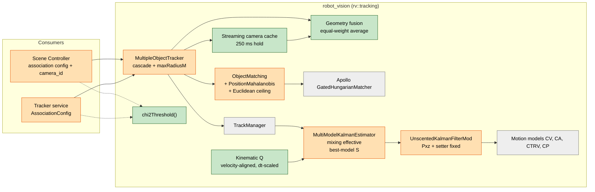
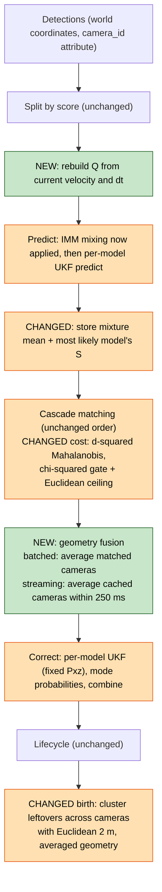
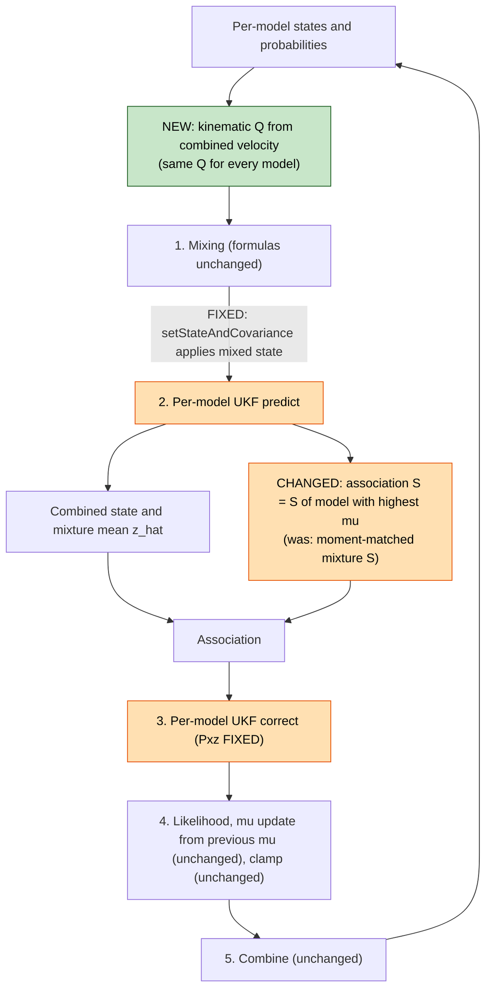
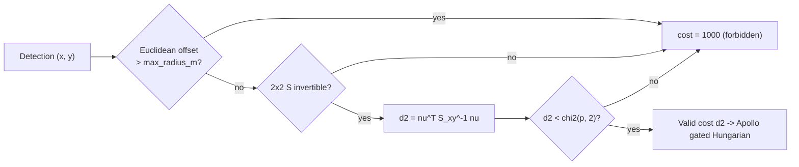
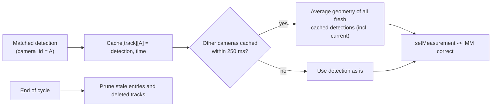

<!--
SPDX-FileCopyrightText: (C) 2026 Intel Corporation
SPDX-License-Identifier: Apache-2.0
-->

# Robot Vision Tracking: `feature/prob-tracking` vs `main`

| Item              | Value                                                                                                                                                                  |
| ----------------- | ---------------------------------------------------------------------------------------------------------------------------------------------------------------------- |
| Analyzed branch   | `feature/prob-tracking`                                                                                                                                                |
| Analyzed commit   | `188c40e79c38d3f5daf250cb98c1f9fd87163124`                                                                                                                             |
| Baseline          | `main` at `d6bccbc0f30b7606fa864bff7dcb0a97c09e8e21` (merge base; `robot_vision` is unchanged on `main` up to `25907384a`, the last `main` merged into the branch)     |
| Baseline report   | [robot-vision-tracking-algorithms.md](robot-vision-tracking-algorithms.md) (section numbers "B-x" below refer to it)                                                    |
| Scope             | Core algorithms in [controller/src/robot_vision](../../controller/src/robot_vision) and how the two consumers now configure them                                        |
| Out of scope      | Benchmarks, UI association-window rendering, Manager/REST changes, Tracker service foot-point projection (TYPE_2 shift, `footprint_half_m`)                            |
| Design intent     | [ADR-0017](../adr/0017-probabilistic-tracking-association.md), [design doc](../design/probabilistic-tracking-association.md) ("Phase 1")                                |

All links are relative to this folder (`docs/development/`) and point to the analyzed commit. Baseline behavior is
described in the baseline report, which links to the same files as they were on `main`.

## 1. Summary

In simple terms: the branch changes **how the tracker decides that a detection belongs to a track**. On `main` the
decision used a fixed 2 m circle. Now it uses an **uncertainty ellipse** that is small for well-tracked objects, grows
when an object is not seen, and stretches in the direction the object moves. To make that ellipse trustworthy, the
branch also fixes two filter bugs from the baseline report, redesigns the process noise, and averages positions when
several cameras see the same object.

| Stage              | Algorithm                          | Delta vs `main`                                                                                                                               | Classic or customized (new)                                                          |
| ------------------ | ---------------------------------- | --------------------------------------------------------------------------------------------------------------------------------------------- | ------------------------------------------------------------------------------------ |
| Filter             | UKF                                | **Two bug fixes**: correct $P_{xz}$ (sigma-point pairing) and working `setStateAndCovariance()`; new `setProcessNoiseCov()`                     | **Classic** now (matches an exact Kalman filter for linear models)                   |
| Filter             | Process noise $Q$                  | **Redesigned**: $\Delta t$-scaled, aligned with velocity, recomputed every predict; no direct position/size noise                              | **Custom** (simplified continuous white-noise model + along/cross-track shaping)     |
| Filter             | Initial covariance $P_0$           | **Redesigned**: per-state values instead of $1 \cdot I$                                                                                        | Classic practice, custom values                                                     |
| Multiple models    | IMM                                | **Mixing now effective**; association uses the **most likely model's** $S$; `initialize()` resets filters                                       | **Classic** structure now effective; still customized (probability update, clamp, $S$ choice) |
| Motion models      | CV, CA, CTRV, CP                   | Unchanged                                                                                                                                     | Unchanged (classic, CTRV custom parametrization)                                     |
| Cost               | **New** `PositionMahalanobis`      | Squared 2-D Mahalanobis on $(x, y)$ with $\chi^2$ gate and a Euclidean safety ceiling; Euclidean also honors the ceiling                        | **Classic** gating/GNN + custom ceiling                                              |
| Matching           | Apollo gated Hungarian             | Unchanged code; now fed $d^2$ costs and a $\chi^2$ threshold                                                                                   | Unchanged (classic)                                                                  |
| Strategy           | Cascade + score split              | Unchanged                                                                                                                                     | Unchanged                                                                            |
| Multi-camera       | Batched fusion                     | Last-camera-wins → **equal-weight averaging**                                                                                                  | Custom (simple averaging)                                                            |
| Multi-camera       | **New** streaming fusion           | Per-track, per-camera cache (250 ms) averaged in non-batched mode                                                                              | Custom                                                                               |
| Multi-camera       | Birth clustering                   | Always Euclidean 2 m (decoupled from association metric); geometry averaged                                                                    | Custom                                                                               |
| Lifecycle          | TrackManager                       | Unchanged                                                                                                                                     | Unchanged                                                                            |
| Consumers          | Controller, Tracker service        | Default `position_mahalanobis`, $p = 0.99$ ($\chi^2 = 9.21$), ceiling 10 m; per-class `tracking_radius` ignored                                | –                                                                                    |

Status of the baseline findings (B-9):

| #  | Baseline finding                                   | Status on branch                                                                    |
| -- | -------------------------------------------------- | ----------------------------------------------------------------------------------- |
| 1  | IMM mixing is a no-op                              | **Fixed** (verified)                                                                |
| 2  | Mode probability update ignores transition matrix  | Not changed; the transition matrix now acts through mixing                           |
| 3  | UKF cross-covariance quirk                         | **Fixed** (verified: UKF equals exact KF to $10^{-15}$)                             |
| 4  | Negative center sigma weights                      | Not changed                                                                         |
| 5  | $Q$ not scaled with $\Delta t$                     | **Fixed** (new $Q$ is $\Delta t$-scaled)                                            |
| 6  | Low-score stage never triggers                     | Not changed (class encoding unchanged in both consumers)                            |
| 7  | Uncertainty-aware gating unused                    | **Fixed** (`PositionMahalanobis` is the production default)                         |
| 8  | Multi-camera measurements not fused                | **Addressed** with equal-weight averaging                                           |
| 9  | Mahalanobis not $\chi^2$-calibrated                | **Addressed** by the new metric (old `Mahalanobis` type unchanged)                  |
| 10 | Swapped covariance getters, Python `beta` default  | Not changed; separately, the Python `match()` argument-order bug is **fixed**       |

## 2. Files Changed

| File                                                                                                                  | Change                                                                                                  |
| --------------------------------------------------------------------------------------------------------------------- | ------------------------------------------------------------------------------------------------------- |
| [UnscentedKalmanFilter.hpp](../../controller/src/robot_vision/include/rv/tracking/UnscentedKalmanFilter.hpp#L120-L129) | Setter fixed; `setProcessNoiseCov()` added                                                              |
| [UnscentedKalmanFilter.cpp](../../controller/src/robot_vision/src/rv/tracking/UnscentedKalmanFilter.cpp#L189-L212)     | $P_{xz}$ fix in `correct()`                                                                             |
| [MultiModelKalmanEstimator.hpp](../../controller/src/robot_vision/include/rv/tracking/MultiModelKalmanEstimator.hpp)   | New Q helpers, stored noise parameters                                                                  |
| [MultiModelKalmanEstimator.cpp](../../controller/src/robot_vision/src/rv/tracking/MultiModelKalmanEstimator.cpp)       | Structured $P_0$, kinematic $Q$, best-model $S$ for association, `initialize()` reset                   |
| [ObjectMatching.hpp](../../controller/src/robot_vision/include/rv/tracking/ObjectMatching.hpp#L23-L38)                | `PositionMahalanobis`, `max_radius_m` parameter                                                         |
| [ObjectMatching.cpp](../../controller/src/robot_vision/src/rv/tracking/ObjectMatching.cpp)                            | New cost, cached per-track inverse, Euclidean ceiling                                                   |
| [Utils.hpp](../../controller/src/robot_vision/include/rv/Utils.hpp#L63-L76)                                            | `chi2Threshold()`                                                                                       |
| [MultipleObjectTracker.hpp](../../controller/src/robot_vision/include/rv/tracking/MultipleObjectTracker.hpp#L64-L72)   | Birth radius and streaming hold constants, camera measurement cache                                     |
| [MultipleObjectTracker.cpp](../../controller/src/robot_vision/src/rv/tracking/MultipleObjectTracker.cpp)              | Geometry fusion, streaming fusion, `maxRadiusM` plumbing, Euclidean birth clustering                   |
| [extensions/tracking.cpp](../../controller/src/robot_vision/python/src/robot_vision/extensions/tracking.cpp)          | New enum value, `max_radius_m` argument, `chi2_threshold()`, `match()` argument order fixed             |

Unchanged: motion models, [TrackManager.cpp](../../controller/src/robot_vision/src/rv/tracking/TrackManager.cpp),
[TrackTracker.cpp](../../controller/src/robot_vision/src/rv/tracking/TrackTracker.cpp),
[Classification.cpp](../../controller/src/robot_vision/src/rv/tracking/Classification.cpp), and the Apollo matcher
([rv/apollo](../../controller/src/robot_vision/include/rv/apollo)).

## 3. Architecture: What Changed

### 3.1 Component view

Orange = modified, green = new, grey = unchanged.

### 3.2 One tracking cycle

Same skeleton as B-3.2; highlighted boxes are new or behave differently.

## 4. Kalman Filtering

### 4.1 UKF: two fixes

**In simple terms.** The filter's "how much should a detection change my speed estimate?" calculation paired the wrong
sample points, so speed was learned too slowly. This is now fixed. The function that lets the IMM hand a blended state
to each filter now actually works.

| Change                         | `main`                                                                                        | Branch                                                                                                                                                                            |
| ------------------------------ | --------------------------------------------------------------------------------------------- | --------------------------------------------------------------------------------------------------------------------------------------------------------------------------------- |
| Cross-covariance $P_{xz}$      | Deviations of *propagated* sigma points × measurement deviations of *redrawn* sigma points      | Both from the **same redrawn** set: $\sum_i W_i^c (\mathcal{X}_i - \hat{x}^-)(\mathcal{Z}_i - \hat{z})^T$ ([L192-L197](../../controller/src/robot_vision/src/rv/tracking/UnscentedKalmanFilter.cpp#L192-L197)) |
| `setStateAndCovariance()`      | Parameters shadowed members, no effect                                                        | Renamed parameters, members assigned ([hpp L120-L124](../../controller/src/robot_vision/include/rv/tracking/UnscentedKalmanFilter.hpp#L120-L124))                               |
| `setProcessNoiseCov()`         | –                                                                                             | New, allows a time-varying $Q$ ([hpp L126-L129](../../controller/src/robot_vision/include/rv/tracking/UnscentedKalmanFilter.hpp#L126-L129))                                     |
| Sigma-point parameters         | $\alpha = 1$, $\beta = 2$, $\kappa = 3 - n$                                                   | Unchanged (negative center weight remains)                                                                                                                                        |

Verification (same test as B-10, linear CV model, where a correct UKF must equal the exact Kalman filter):

| Update | `main` UKF $v_x$ | Branch UKF $v_x$ | Exact KF $v_x$ |
| ------ | ---------------- | ---------------- | -------------- |
| 1      | 0.000            | 0.008            | 0.008          |
| 10     | 0.763            | 0.815            | 0.815          |
| 30     | 0.971            | 0.991            | 0.991          |

Maximum state difference branch vs exact KF over 30 updates: $6.7 \times 10^{-15}$. `setStateAndCovariance(42, 7·I)`
now reads back 42 and 7.

Verdict: the UKF is now a **classic** scaled-UT UKF. The only remaining customization is the one from B-5.1 (measurement
prediction computed inside `predict()`).

### 4.2 Process noise $Q$: redesigned

**In simple terms.** Process noise says "how much can the object surprise me between two frames". On `main` it was
the same tiny number for every state, every frame, regardless of time gap. Now it grows with the time gap, is only
applied to velocity (position uncertainty then grows naturally from velocity uncertainty), and is much larger along the
direction of motion than sideways – people and vehicles speed up or slow down far more often than they jump sideways.

Implementation: [kinematicProcessNoiseCov](../../controller/src/robot_vision/src/rv/tracking/MultiModelKalmanEstimator.cpp#L116-L150),
applied before every predict by [updateProcessNoiseForPredict](../../controller/src/robot_vision/src/rv/tracking/MultiModelKalmanEstimator.cpp#L152-L159)
using the current combined velocity, and pushed into **all** model filters.

With speed $s = \lVert v \rVert$, direction $u = v / s$ (world $x$-axis if $s \le 10^{-3}$), perpendicular $u_\perp$:

$$
q_v = \max(1000\,q,\ 10^{-3}),\quad
q_{\parallel} = q_v (1 + s),\quad
q_{\perp} = 0.01\,q_v,\quad
Q_{vv} = Q_{aa} = \big(q_{\parallel}\, u u^T + q_{\perp}\, u_\perp u_\perp^T\big)\,\Delta t
$$

$$
Q_{\psi\psi} = 0.01\,q\,\Delta t,\qquad Q_{\omega\omega} = q\,\Delta t,\qquad Q_{\text{pos}} = Q_{z} = Q_{l,w,h} = 0
$$

| Quantity (production $q = 10^{-4}$, 10 fps, walking 1.4 m/s) | `main`            | Branch                          |
| ------------------------------------------------------------ | ----------------- | ------------------------------- |
| Velocity noise per step, along track                         | $10^{-4}$         | $0.024$                         |
| Velocity noise per step, cross track                         | $10^{-4}$         | $10^{-4}$                       |
| Position noise per step                                      | $10^{-4}$         | 0 (grows via $\Delta t \cdot v$) |
| Size / height noise per step                                 | $10^{-4}$         | 0                               |
| Yaw noise per step                                           | $10^{-4}$         | $10^{-7}$                       |

**Classic vs customized.** The $\Delta t$-scaling and the "noise enters through velocity" idea come from the
**classic continuous white-noise acceleration model**, which is
$q\begin{bmatrix}\Delta t^3/3 & \Delta t^2/2 \\ \Delta t^2/2 & \Delta t\end{bmatrix}$ per axis; the branch keeps only
the velocity term (a simplification). **Custom:** along/cross-track shaping with a fixed 100:1 ratio, speed-dependent
growth $(1+s)$, reuse of the velocity values for the acceleration block, one $Q$ shared by all IMM models (classic IMM
designs usually give each model its own noise level), and zero noise on size and height.

### 4.3 Initial covariance $P_0$

[MultiModelKalmanEstimator.cpp L79-L95](../../controller/src/robot_vision/src/rv/tracking/MultiModelKalmanEstimator.cpp#L79-L95).

| States                     | `main` | Branch (production values)                 |
| -------------------------- | ------ | ------------------------------------------ |
| $x, y, z, l, w, h$         | 1.0    | $r = 0.2$ (measurement noise)              |
| $v_x, v_y$                 | 1.0    | $\min(P_0, 0.05) = 0.05$                   |
| $a_x, a_y$                 | 1.0    | $\min(P_0, 0.1) = 0.1$                     |
| yaw $\psi$                 | 1.0    | $\min(P_0, 0.05) = 0.05$                   |
| yaw rate $\omega$          | 1.0    | $\min(P_0, 0.01) = 0.01$                   |

**In simple terms.** A new track now "knows" that its position is about as good as one detection, and assumes the object
is probably not moving fast. This keeps the first gates small (fewer wrong matches right after birth) at the cost of
learning the speed of a fast object more slowly.

**Classic vs customized.** Initializing measured states with $R$ and unmeasured states with a prior is **classic**
single-point initialization; the caps are **custom** tuning values.

## 5. IMM Estimator

### 5.1 What changed

| Step                    | `main`                                         | Branch                                                                                                                                                                                                                  | Classic?                                   |
| ----------------------- | ---------------------------------------------- | ----------------------------------------------------------------------------------------------------------------------------------------------------------------------------------------------------------------------- | ------------------------------------------ |
| Mixing                  | Computed, discarded                            | Applied to each filter before predict ([L238-L245](../../controller/src/robot_vision/src/rv/tracking/MultiModelKalmanEstimator.cpp#L238-L245))                                                                           | **Classic IMM** now                        |
| Process noise           | Fixed $q\,I$ per model                         | Shared kinematic $Q$ ([L215](../../controller/src/robot_vision/src/rv/tracking/MultiModelKalmanEstimator.cpp#L215))                                                                                                     | Custom                                     |
| Association covariance  | Mixture $S = \sum_j \mu_j [S_j + (\hat z_j - \hat z)(\cdot)^T]$ | $S_{j^*}$ with $j^* = \arg\max_j \mu_j$; mean stays the mixture $\hat z$ ([L290-L307](../../controller/src/robot_vision/src/rv/tracking/MultiModelKalmanEstimator.cpp#L290-L307)) | **Custom**                                 |
| Mode probability update | Uses previous $\mu$                            | Unchanged ([L516](../../controller/src/robot_vision/src/rv/tracking/MultiModelKalmanEstimator.cpp#L516))                                                                                                                | Deviation remains                          |
| Probability clamp       | $[0.025, 0.95]$                                | Unchanged ([L519](../../controller/src/robot_vision/src/rv/tracking/MultiModelKalmanEstimator.cpp#L519))                                                                                                                | Custom                                     |
| Re-initialization       | Appended extra filters on a second `initialize()` | Clears filters and model states first ([L31-L32](../../controller/src/robot_vision/src/rv/tracking/MultiModelKalmanEstimator.cpp#L31-L32))                                                                           | Bug fix                                    |

**In simple terms.** The IMM now works as designed: before each prediction every motion model starts from a blend of
all models' opinions, weighted by how likely each model is. For the gate, the branch deliberately uses the uncertainty
of the single most likely model, so that an unlikely "turning" hypothesis cannot make the gate round and wide.

### 5.2 Measured effect

Same scenario for both branches (throwaway program, production noise values, CV + CA + CTRV, 10 fps, position noise
σ = 0.1 m, fixed random seed). Gate axes are the $\chi^2_{0.99}$ ellipse radii $\sqrt{9.21\,\lambda}$ of the 2×2
position block of the stored `predictedMeasurementCov`. `main` used a fixed 2 m Euclidean circle in production, so its
columns show the filter's uncertainty only, not its real gate.

Walking at 1.4 m/s, heading 30°:

| Update | `main` speed | Branch speed | `main` axes (m) / angle | Branch axes (m) / angle | `main` μ (CV, CA, CTRV) | Branch μ (CV, CA, CTRV) |
| ------ | ------------ | ------------ | ----------------------- | ----------------------- | ----------------------- | ----------------------- |
| 1      | 0.00         | 0.00         | 3.34 × 3.34             | 1.92 × 1.92             | .33 .33 .33             | .33 .33 .33             |
| 5      | 0.42         | 0.07         | 1.74 × 1.74             | 1.51 × 1.50             | .34 .33 .34             | .33 .33 .33             |
| 10     | 1.13         | 0.55         | 1.65 × 1.64             | 1.50 × 1.47 / 25°       | .36 .28 .36             | .33 .33 .33             |
| 20     | 1.27         | 1.53         | 1.58 × 1.53             | 1.54 × 1.47 / 30°       | .50 .19 .31             | .34 .31 .34             |
| 60     | 1.36         | 1.41         | 1.44 × 1.43             | 1.55 × 1.42 / 30°       | .55 .21 .25             | .35 .31 .35             |

Coasting (no detections) after update 60:

| Coast time | `main` axes (m) | Branch axes (m) / angle | `main` position error | Branch position error |
| ---------- | --------------- | ----------------------- | --------------------- | --------------------- |
| 0.5 s      | 1.49 × 1.45     | 1.84 × 1.44 / 30°       | 0.09 m                | 0.04 m                |
| 1.0 s      | 1.57 × 1.51     | 2.47 × 1.47 / 30°       | 0.11 m                | 0.03 m                |

What this shows:

- The gate now **points along the motion** (30°) and **stretches when the object is not seen**; cross-track width stays
  about 1.45 m. On `main` it was nearly round with a random orientation.
- Steady-state speed is more accurate (1.41 vs 1.36 m/s) and coasting prediction error is lower.
- Speed is learned **more slowly right after birth** (0.55 vs 1.13 m/s after 1 s) because of the smaller velocity
  prior; it briefly overshoots (1.53 at update 20).
- With mixing active, the three models make almost identical short-term predictions, so **model probabilities stay
  near uniform**. The IMM output is then effectively an average of three similar filters.

## 6. Data Association

### 6.1 New cost: `PositionMahalanobis`

**In simple terms.** Instead of "is the detection within 2 m?", the question becomes "is the detection inside the
track's 99 % uncertainty ellipse?". A distance of 1 m can be accepted along the direction of motion and rejected
sideways. A hard 10 m limit protects against absurd matches when the ellipse grows very large.

| Element        | Implementation                                                                                                                                                                                                                                                        |
| -------------- | --------------------------------------------------------------------------------------------------------------------------------------------------------------------------------------------------------------------------------------------------------------------- |
| Cost           | $d^2 = \nu^T S_{xy}^{-1} \nu$, $\nu = (x, y)_{\text{det}} - (\hat x, \hat y)$, $S_{xy}$ = top-left 2×2 of the stored $S$ ([L105-L119](../../controller/src/robot_vision/src/rv/tracking/ObjectMatching.cpp#L105-L119))                                                   |
| Performance    | 2×2 inverse computed once per track, cost matrix filled in parallel ([L162-L180](../../controller/src/robot_vision/src/rv/tracking/ObjectMatching.cpp#L162-L180), [L84-L103](../../controller/src/robot_vision/src/rv/tracking/ObjectMatching.cpp#L84-L103))            |
| Gate           | Matcher threshold = $\chi^2_2(p) = -2\ln(1-p)$; $p = 0.99 \Rightarrow 9.21$ ([Utils.hpp L63-L76](../../controller/src/robot_vision/include/rv/Utils.hpp#L63-L76))                                                                                                        |
| Safety ceiling | Euclidean offset above `max_radius_m` → bound value; also applied to `Euclidean` ([L196-L204](../../controller/src/robot_vision/src/rv/tracking/ObjectMatching.cpp#L196-L204))                                                                                            |
| Unused helper  | `calculatePositionMahalanobisSquaredDistance` ([L47-L69](../../controller/src/robot_vision/src/rv/tracking/ObjectMatching.cpp#L47-L69)) is defined but never called                                                                                                     |

**Classic vs customized.** Ellipsoidal gating with a $\chi^2$ threshold and minimizing the sum of squared Mahalanobis
distances is the **classic** Global Nearest Neighbor (GNN) approach (Bar-Shalom & Fortmann; the same gate idea is used
in DeepSORT). Correctly using the **marginal** 2×2 block also fixes the "zeroed yaw" problem of the old `Mahalanobis`
type (B-9 item 9). **Custom:** the Euclidean ceiling, and a cost without the $\ln|S|$ term used in likelihood-based GNN
(see [Section 9](#9-new-observations-and-potential-issues)).

### 6.2 Production configuration

| Setting                 | `main`                                  | Branch                                                                                                                                                                                                                                                  |
| ----------------------- | --------------------------------------- | ------------------------------------------------------------------------------------------------------------------------------------------------------------------------------------------------------------------------------------------------------- |
| Distance type           | `Euclidean`                             | `PositionMahalanobis` (`euclidean` kept as rollback)                                                                                                                                                                                                    |
| Threshold               | Controller: mean per-class `tracking_radius` (2 m default); Tracker: 2 m | $\chi^2_{0.99} = 9.21$                                                                                                                                                                                                  |
| Ceiling                 | –                                       | 10 m                                                                                                                                                                                                                                                    |
| Controller              | –                                       | [association_match_params](../../controller/src/controller/ilabs_tracking.py#L103-L121), config in [tracker-config.json](../../controller/config/tracker-config.json); adds `camera_id` attribute ([L324-L327](../../controller/src/controller/ilabs_tracking.py#L324-L327)) |
| Tracker service         | –                                       | [AssociationConfig](../../tracker/inc/association_config.hpp), call at [tracking_worker.cpp L313-L314](../../tracker/src/tracking_worker.cpp#L313-L314), config in [tracker.json](../../tracker/config/tracker.json)                                   |
| Class vector            | `[c, 1 - c]` / `[1.0]`                  | Unchanged, so the low-score stage is still inactive                                                                                                                                                                                                     |

The Apollo gated Hungarian matcher and the cascade order (B-6.2, B-6.3) are unchanged; they now receive $d^2$ costs.

## 7. Multi-Camera Fusion

### 7.1 Batched mode (time-chunked controller, Tracker service)

**In simple terms.** When two cameras see the same person, `main` kept only the last camera's position. The branch
averages all cameras that matched the track: position, height and size by plain mean, yaw by a circular mean.

- [fuseGeometry](../../controller/src/robot_vision/src/rv/tracking/MultipleObjectTracker.cpp#L60-L106), used at
  [L468-L472](../../controller/src/robot_vision/src/rv/tracking/MultipleObjectTracker.cpp#L468-L472).
- **Classic vs customized:** equal-weight averaging is the simplest **classic** measurement-fusion rule (it assumes every
  camera is equally accurate). The fused measurement still uses the single-camera $R$, which is conservative.
  The design doc calls this a stopgap until per-detection $R$ arrives (Phase 2).

### 7.2 Streaming mode (non-chunked controller) – new

**In simple terms.** When cameras arrive one at a time, the tracker now remembers each camera's latest detection of
each track for 250 ms and averages them on every update.

- [rememberCameraMeasurement](../../controller/src/robot_vision/src/rv/tracking/MultipleObjectTracker.cpp#L253-L263),
  [fuseStreamingCameraMeasurements](../../controller/src/robot_vision/src/rv/tracking/MultipleObjectTracker.cpp#L265-L300),
  [pruneCameraMeasurements](../../controller/src/robot_vision/src/rv/tracking/MultipleObjectTracker.cpp#L302-L341),
  hold time [kStreamingMultiCamHold](../../controller/src/robot_vision/include/rv/tracking/MultipleObjectTracker.hpp#L72).
- Requires a `camera_id` attribute (missing IDs all map to `"unknown"`, which disables the fusion).
- **Classic vs customized:** **custom**. It is a sliding-window average, not an out-of-sequence or asynchronous
  multi-sensor update: cached detections are neither moved forward in time nor excluded from later reuse.

### 7.3 Birth clustering

| Aspect          | `main`                                                | Branch                                                                                                                                                              |
| --------------- | ----------------------------------------------------- | ------------------------------------------------------------------------------------------------------------------------------------------------------------------- |
| Metric          | Same type and threshold as track association          | Always Euclidean, 2 m ([L580-L581](../../controller/src/robot_vision/src/rv/tracking/MultipleObjectTracker.cpp#L580-L581), [hpp L68](../../controller/src/robot_vision/include/rv/tracking/MultipleObjectTracker.hpp#L68)) |
| Geometry        | Later camera's detection                              | Average of cluster and new camera ([L583-L592](../../controller/src/robot_vision/src/rv/tracking/MultipleObjectTracker.cpp#L583-L592))                              |

Reason (from the code comment): raw detections have no predicted covariance, so a Mahalanobis metric between two
detections is meaningless. Decoupling keeps the 10 m association ceiling from merging nearby people at birth.

## 8. Unchanged Algorithms

Motion models (B-5.2), cascade and score split (B-6.3), Apollo gated Hungarian (B-6.2), track lifecycle (B-7), class
fusion and yaw unwrapping (B-8), and the ID-based `TrackTracker` (B-6.5) have no algorithmic changes. Their
classic/custom verdicts from the baseline report still apply.

## 9. New Observations and Potential Issues

Ordered by expected impact.

1. **Size, height and yaw become stiff.** $Q = 0$ for $z, l, w, h$ and $Q_{\psi\psi} = 10^{-7}$ per step mean their
   variances only shrink, so the filter slowly turns into a running average. Measured yaw step 0 → 0.5 rad on a
   stationary object: after 1 / 5 / 10 s the estimate is 0.11 / 0.30 / 0.37 rad on the branch vs 0.15 / 0.38 / 0.46 rad
   on `main`. This matters for detectors that report orientation (the controller uses tracked yaw only then).
2. **Slower speed acquisition at birth** – $P_{v,0} = 0.05$ halves the speed estimate after 1 s (Section 5.2). Fast
   objects that appear already moving will lag for the first second.
3. **Streaming fusion mixes measurements from different times** – a cached detection up to 250 ms old is averaged
   without moving it forward in time. At 1.4 m/s that is up to 0.35 m behind, so the average lags by up to about
   0.17 m. The same cached detection can also be reused in several updates, which makes the filter overconfident.
4. **Association covariance does not match the mean** – the mean is the IMM mixture but $S$ comes from one model, so
   the spread between models is dropped. The gate can be too tight exactly when models disagree (for example at the
   start of a turn). When probabilities are near uniform (Section 5.2), the chosen model can also switch from frame to
   frame.
5. **Cost without $\ln|S|$** – because the cost is $d^2$ only, a track with a large ellipse (for example coasting) can
   win an ambiguous detection against a well-localized track at the same distance. Likelihood-based GNN adds
   $\ln|S|$ to prevent this.
6. **Circular-mean yaw ignores the 180° ambiguity** – averaging $\psi$ and $\psi + \pi$ from two cameras cancels to an
   arbitrary angle ([L105](../../controller/src/robot_vision/src/rv/tracking/MultipleObjectTracker.cpp#L105)), unlike the
   π-aware unwrapping used in the filter (B-8).
7. **Unequal weights in birth clustering** – averaging pairwise camera by camera gives weights ¼, ¼, ½ for three
   cameras instead of ⅓ each.
8. **Weak model discrimination** – with mixing active and one shared $Q$, CV/CA/CTRV probabilities stay at
   0.31–0.35 in the walking test. Per-model process noise would give the IMM a stronger signal.
9. **Arbitrary noise direction for stationary objects** – below 1 mm/s the along-track axis defaults to world $x$,
   above that it follows the noisy velocity. The measured effect is small (1.50 × 1.48 m ellipse).
10. **Carried over from `main`** – mode probability update without $\Pi$, negative center weights, inactive low-score
    stage, swapped covariance getters, Python `beta` default 1.0; plus an unused helper function (Section 6.1).

## 10. How This Analysis Was Verified

- Source diff: `git diff d6bccbc 188c40e79 -- controller/src/robot_vision`; confirmed `main` did not touch
  `robot_vision` between `d6bccbc` and `25907384a`.
- UKF fixes: the throwaway program from B-10, built against both trees, plus a `setStateAndCovariance()` read-back.
- Estimator behavior (Section 5.2 and item 1 of Section 9): one throwaway program linking
  `MultiModelKalmanEstimator` with CV/CA/CTRV and production noise settings, built against `main` (extracted with
  `git archive d6bccbc`) and against the branch. Same seed, same measurements.
- Throwaway programs were built outside the repository and are not committed.

## 11. References

- Baseline report: [robot-vision-tracking-algorithms.md](robot-vision-tracking-algorithms.md).
- [ADR-0017: Probabilistic Tracking Association](../adr/0017-probabilistic-tracking-association.md),
  [design document](../design/probabilistic-tracking-association.md),
  [implementation plan](../../.github/plans/plan-probabilistic-tracking.md).
- Y. Bar-Shalom, T. E. Fortmann, *Tracking and Data Association*, 1988 (validation gates, GNN).
- Y. Bar-Shalom, X. R. Li, T. Kirubarajan, *Estimation with Applications to Tracking and Navigation*, 2001
  (white-noise acceleration models, IMM).
- E. A. Wan, R. van der Merwe, "The Unscented Kalman Filter for Nonlinear Estimation", 2000.
- H. A. P. Blom, Y. Bar-Shalom, "The Interacting Multiple Model Algorithm for Systems with Markovian Switching
  Coefficients", IEEE TAC, 1988.
