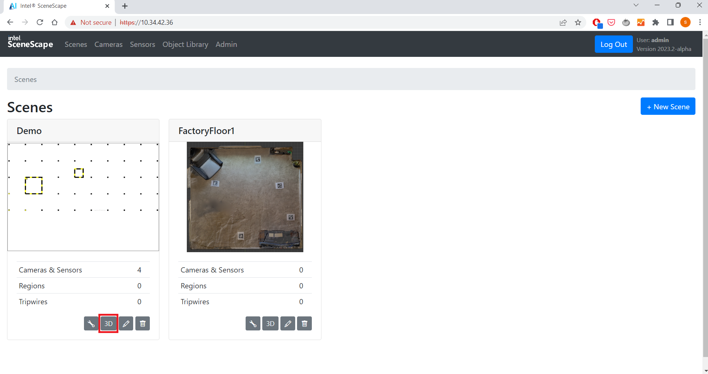

# How to Use the Intel® SceneScape 3D UI for Camera Calibration

This guide provides step-by-step instructions to use the Intel® SceneScape 3D UI to manage and calibrate cameras in a 3D scene. By completing this guide, you will:

- Navigate the 3D UI.
- Add, modify, or delete cameras.
- Calibrate cameras interactively within a 3D scene.

This task is important for developers or customers using Intel® SceneScape to visually manage and align camera data with 3D environments. If you're new to Intel® SceneScape, see the [Intel® SceneScape README](https://github.com/open-edge-platform/scenescape/blob/main/README.md).

---

## Prerequisites

Before you begin:

- **SceneScape Installed**: Intel® SceneScape must be installed and accessible via your browser.
- **3D Scene Loaded**: A glTF/GLB file should be uploaded and attached to a scene.
- **Permissions**: Ensure you have permissions to create or modify camera data.

---

## Steps to Use the 3D UI

### Step 1: Launch the 3D UI

1. Log in to Intel® SceneScape.
2. On the homepage, identify a scene and click its `3D` button
   
3. You will be directed to the 3D UI view.
   

   **Expected Results**:
   - Scene loads with camera icons, tracked objects, and a glTF/GLB background.

### Step 2: Add or Modify a Camera

1. Click on `Add Camera` to place a new camera.
2. Select a camera by clicking its icon in the scene.
3. Use transform tools to rotate or move the camera.
   
   **Camera Control Panel Options**:
   - **name**: Assign a custom name.
   - **scene camera**: Set view to camera's perspective.
   - **toggle rotate/translate**: Switch between rotation and translation tools.
   - **project frame**: Display camera frame projected into the 3D scene.
   - **pause video**: Pause live camera feed.
   - **opacity**: Adjust projection transparency.
   - **extrinsics/intrinsics/distortion**: Configure camera settings.
   - **save camera**: Persist the current camera configuration.
   - **delete camera**: Remove selected camera.

### Step 3: Calibrate the Camera

1. Ensure camera is facing the scene for proper projection.
2. Enable `project frame`.
   
3. Double-click on the projected image area to create a calibration point. Repeat until four points are added.
   
4. Drag the calibration spheres to align the projection with the 3D scene.
   
5. Click save to persist the calibration.

   **Tips**:
   - Choose distinct, identifiable image features.
   - Space calibration points apart for better accuracy.

---

## Configuration Options

| Parameter    | Purpose                         | Expected Values                  |
| ------------ | ------------------------------- | -------------------------------- |
| camera_name  | Custom label for the camera     | String                           |
| extrinsics   | Camera position and orientation | Matrix or 3D transform values    |
| intrinsics   | Lens configuration              | fx, fy, cx, cy, etc.             |
| distortion   | Lens distortion coefficients    | k1, k2, p1, p2, etc.             |
| opacity      | Transparency of projected image | 0.0 (transparent) to 1.0 (solid) |

---

## Troubleshooting

1. **Issue: If you use 3D UI Camera Calibration, the 8-points in 2D UI Camera Calibration will no longer be consistent with the current pose.**

---

## Supporting Resources
- [Intel® SceneScape README](https://github.com/open-edge-platform/scenescape/blob/main/README.md)
