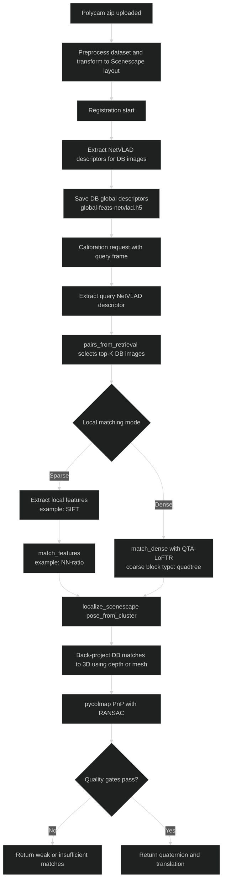

<!-- SPDX-FileCopyrightText: (C) 2026 Intel Corporation -->
<!-- SPDX-License-Identifier: Apache-2.0 -->

# Markerless Camera Calibration Internals

The markerless calibration path uses a Hierarchical Localization (HLoc) workflow with two stages:

1. **Global retrieval** with **NetVLAD** to find candidate database images.
2. **Local matching** (sparse or dense) followed by geometric pose solving.

## How NetVLAD is used

- NetVLAD is downloaded and SHA256-verified in the background, without blocking the
  autocalibration application from starting: Docker Compose uses `autocalibration-model-init`,
  while Kubernetes uses the chart's background download sidecar and a persistent NetVLAD PVC.
- The application does not download the model during a calibration request. If the verified
  model is not yet present, markerless calibration fails with a clear error reporting the
  expected model path, while AprilTag calibration is unaffected.
- During scene registration, the service extracts global descriptors for dataset images and stores them in an HDF5 file (for example, `global-feats-netvlad.h5`).
- During camera localization, the service extracts a NetVLAD descriptor for the query frame and uses `pairs_from_retrieval` to retrieve top-$K$ candidates (`number_of_localizations`, default `50`) from the registered descriptor database.
- The retrieved image pairs define the shortlist for local feature matching and pose estimation.

## How quadtree attention is used

- Scenescape integrates a custom HLoc matcher based on **QTA-LoFTR** (`qta_loftr.py`) that loads the QuadTreeAttention implementation.
- In this matcher, LoFTR coarse matching is configured with `BLOCK_TYPE = "quadtree"` (with `ATTN_TYPE = "B"` and tuned `TOPKS`) to reduce attention cost while preserving long-range correspondences.
- Dense matching is selected when a local feature entry is `"-"`; otherwise, the service runs sparse extraction and matching.

## How HLoc ties the pipeline together

- Registration and localization are orchestrated from the markerless calibration module.
- HLoc modules used include `extract_features`, `pairs_from_retrieval`, `match_features` / `match_dense`, and `localize_scenescape`.
- `localize_scenescape.pose_from_cluster` back-projects matched keypoints to 3D using scene depth or mesh, then runs PnP (`pycolmap.absolute_pose_estimation`) to estimate camera pose.
- The service validates results with two quality gates before returning success:
  - `minimum_number_of_matches` (default `20`)
  - `inlier_threshold` (default `0.5`, computed as $\frac{n_{inliers}}{n_{matches}}$)

## Flow Diagram: Registration and Localization

These values are scene-level configuration inputs from the service model: `global_feature`, `local_feature`, `matcher`, `number_of_localizations`, `minimum_number_of_matches`, and `inlier_threshold`.
