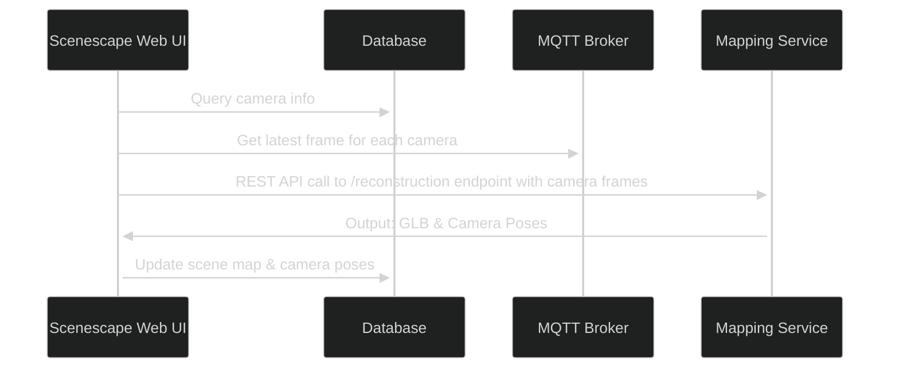

# Mapping Service

<!--hide_directive

  <a class="icon_github" href="https://github.com/open-edge-platform/scenescape/tree/main/mapping/">
     GitHub
  </a>
  <a class="icon_document" href="https://github.com/open-edge-platform/scenescape/blob/main/mapping/README.md">
     Readme
  </a>

hide_directive-->

The Mapping Service generates 3D scene reconstructions — meshes, point clouds, and camera parameters (poses and intrinsics) — from a set of captured images or video frames. It exposes a REST API so other microservices can request reconstructions on demand.

## Models

Each container is built with one of two state-of-the-art models:

- **MapAnything**: Universal Feed-Forward Metric 3D Reconstruction
- **VGGT**: Visual Geometry Grounded Transformer for sparse view reconstruction

## Features

- **REST API** with JSON responses
- **Build-Time Model Selection**: Single model per container, no dependency conflicts
- **Flexible Input**: Multiple images, video files, or both in a single request
- **Multiple Output Formats**: GLB meshes or point clouds
- **Camera Data**: Extracts camera poses and intrinsics alongside geometry
- **Image Enhancement**: Automatic CLAHE preprocessing for improved contrast

## Building and Running

Check out [How to Build from Source](./build-from-source.md) for instructions on building
the service from source and running it.

### Minimum Hardware Requirements

- **CPU**: 12th Gen or newer Intel® Core™ processors (i5 or higher), or 2nd Gen or newer Intel®
  Xeon® processors
- **RAM**:
  - MapAnything: 8GB minimum (4GB for model + overhead)
  - VGGT: 16GB minimum (8GB for model + overhead, more for high resolution images)
- **Storage**: 12GB free space for Docker images and models

### Performance Notes

- **First Run**: Initial model download may take several minutes
- **Memory Requirements**:
  - MapAnything: ~4GB RAM
  - VGGT: ~8GB RAM (more for high resolution)
- **Processing Time**: Varies by image count and resolution

## Scenescape Integration

The following diagram shows the dataflow between the Scenescape Web UI, database, MQTT
broker, and the Mapping Service.

## Development

### Model Comparison

| Feature               | MapAnything           | VGGT                                                                           |
| --------------------- | --------------------- | ------------------------------------------------------------------------------ |
| **License**           | Apache 2.0            | [VGGT License](https://github.com/facebookresearch/vggt/blob/main/LICENSE.txt) |
| **Input**             | Multiple images       | Multiple images/video frames                                                   |
| **Strength**          | Metric reconstruction | Sparse view reconstruction                                                     |
| **Speed**             | Fast                  | Moderate                                                                       |
| **Memory**            | Lower                 | Higher                                                                         |
| **Quality**           | High for dense views  | High for sparse views                                                          |
| **Native Output**     | Watertight mesh       | Point cloud                                                                    |
| **Supported Outputs** | Mesh, Point cloud     | Point cloud, Mesh                                                              |

### Adding Custom Models

To add support for additional models:

1. Create a new model class following the `ReconstructionModel` interface
2. Create a model-specific service file (e.g., `mymodel_service.py`)
3. Add model installation steps to the Dockerfile
4. Update the Makefile to support the new model type
5. Add build-time model selection logic

### Best Practices

- **Image Preprocessing**: All input images automatically undergo Contrast Limited Adaptive
  Histogram Equalization (CLAHE) to enhance contrast and improve reconstruction quality,
  particularly for low-contrast or unevenly-lit scenes.
- **VGGT** pointcloud output scale is orders of magnitude smaller than the actual scene. The
  scale of the output mesh generated by **Map Anything** is closer to the actual scene than
  **VGGT**.
- The output mesh generated by **VGGT** version of the service has several issues currently.
  All of these issues will be addressed in the next Scenescape release:
  - It is not aligned with the original point cloud
  - The resolution of the texture is not sharp.
  - Pointcloud to mesh conversion takes many multiples of time taken by inference that
    generates the pointcloud.
- The service has not been tested with cameras which have distortion. Expect the reconstruction
  to perform poorly if your cameras show visual distortion.
- The reconstruction does not distinguish between static and dynamic objects. If the camera
  frames contain objects like persons, vehicles etc., the reconstruction will include those
  objects as well. For best results, call the service when the camera frames do not contain
  objects that should not be included in the mesh.

## Supporting Resources

- [Build from Source](./build-from-source.md): Build the service from source and run it.
- [API Reference](./api-reference.md): Comprehensive reference for the Mapping service
  REST API endpoints.

<!--hide_directive
:::{toctree}
:hidden:

Build from Source <./build-from-source.md>
API Reference <./api-reference.md>

:::
hide_directive-->
