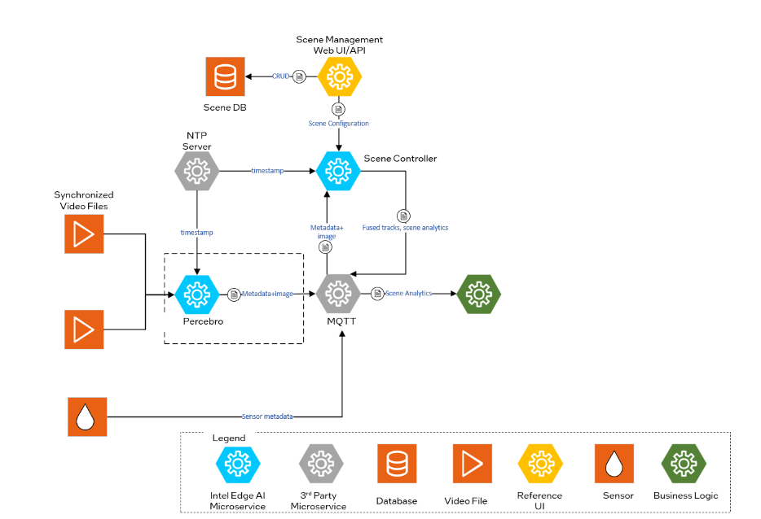

# Percebro Microservice
OpenVINO-based computer vision pipeline tool.

## Overview

Percebro is a powerful tool for running various inferencing tasks in support of Intel® SceneScape scene-based analytics. While it is possible to add cameras and sensors and publish data independently into Intel® SceneScape, Percebro makes it easy to accomplish a variety of inferencing tasks using OpenVINO™ and its collection of pre-trained and optimized models.

Percebro core capabilities include:

- Running inferencing on UVC class USB cameras, RTSP, MJPEG, stored video, and still images (JPEG, PNG) as supported by GStreamer and OpenCV
- Chaining multiple inference operations from a single frame of video, such first detecting all persons and then running each person detection through a secondary model for head detection
- Targeting what hardware to run inference operations on, such as the CPU, GPU, or a vision accelerator card (HDDL) using the OpenVINO™ inference engine
- Asynchronous inferencing operation for optimal throughput
- Publishing all results as JSON objects via MQTT, making the output of video analytics much like other types of sensor data for IoT use cases
- Time synchronization for timestamping inferencing from multiple networked camera streams against a common scene time authority

## Architecture

Figure 1: Architecture Diagram

## Supporting Resources

- [Get Started Guide](get-started.md)
- [API Reference](api-reference.md)
